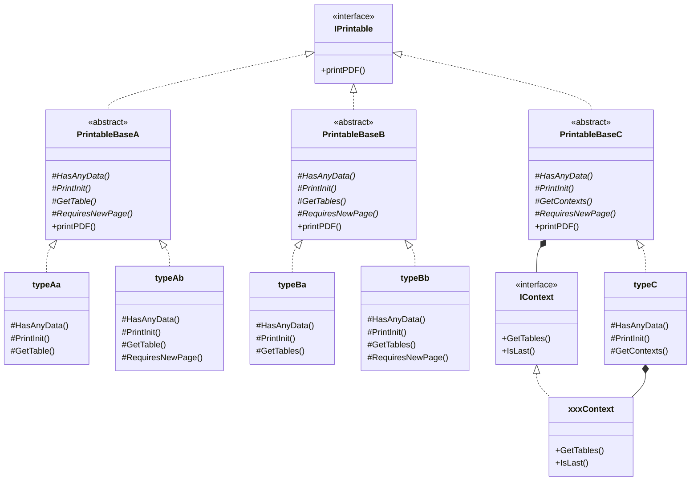

# 「C＃で作成されたPDF出力機能の改善」報告書 <!-- omit in toc -->

* 作成日：2023/1/9
* 作成者：渡邊秀雄(hwatanab4546)

***

## 目次 <!-- omit in toc -->

<!-- markdownlint-disable -->
- [1. 作業報告](#1-作業報告)
  - [1.1 作業内容](#11-作業内容)
  - [1.2 作業環境](#12-作業環境)
  - [1.3 作業期間](#13-作業期間)
  - [1.4 納品物一覧](#14-納品物一覧)
- [2. `PrintInput`および`PrintResult`の全てのクラスの共通機能統合](#2-printinputおよびprintresultの全てのクラスの共通機能統合)
  - [2.1 方針](#21-方針)
  - [2.2 クラス図](#22-クラス図)
- [3. 改ページ制御の改善](#3-改ページ制御の改善)
  - [3.1 ページ下端の不揃いを減らすための改善](#31-ページ下端の不揃いを減らすための改善)
  - [3.2 改ページ制御の一覧](#32-改ページ制御の一覧)
- [4. 変更点一覧](#4-変更点一覧)
  - [4.1 作業対象ファイル](#41-作業対象ファイル)
- [5. その他](#5-その他)
  - [5.1 入力(JSONファイル)に関する特記事項](#51-入力jsonファイルに関する特記事項)
  - [5.2 暫定対応](#52-暫定対応)
<!-- markdownlint-restore -->

***

## 1. 作業報告

### 1.1 作業内容

* `PrintInput`および`PrintResult`の全てのクラスの共通機能統合
* 改ページ機能の改善
  * ページ下端の不揃いを極力減らす
  * ケースが変わる場合は改ページ。同ケースで計算項目が変わった場合は改ページしない。ただし、計算項目が変わる際、ページの10%未満の場合は改ページ

### 1.2 作業環境

* OS：Windows 10 Home 21H2
* 言語：C# 8.0
* フレームワーク：.NET Core 3.1
* 開発環境：Microsoft Visual Studio Community 2022

### 1.3 作業期間

* 2022/12/20 ~ 2023/1/9

### 1.4 納品物一覧

* 2022/12/25送付(中間納品物#1)
  * `FramePrintPDF-20221225-prj.zip`
    * ビルド環境一式
  * `PDF出力-20221225.zip`
    * PDF出力一式
  * オリジナルからの変更点
    * `PrintInput`と`PrintResult`の各クラスの整理を実施
    * 改ページの制御は、基本的なもの(データ行が1行以上表示できなければ改ページする)のみを実装
* 2023/1/2送付(中間納品物#2)
  * `FramePrintPDF-20230102-prj.zip`
    * ビルド環境一式
  * `PDF出力-20230102.zip`
    * PDF出力一式
  * 2022/12/25版からの変更点
    * 下記のキーに対応する出力処理の改ページ制御を本来の制御方法に変更
      |キー|改ページ制御|
      |--|--|
      |(`loadName`)|現ページ入る行数が5行未満なら改ページ|
      |`fix_node`|データ行の半分以上が出力できなければ改ページ|
      |`fsec`|印刷範囲をはみ出る部材データが次ページに納まるなら、その部材データの前で改ページ|
      |`fix_member`|ケース全体が出力できなければ改ページ|
      |`joint`|(同上)|
      |`load`|(同上)|
      |`diag`|(同上)|
      |`reac`|(同上)|
    * 下記のキーに対応する出力処理の改ページ制御を新しい制御方法に変更
      |キー|改ページ制御|
      |--|--|
      |`diagCombine`|Caseが変わる場合は改ページ。同じCaseで計算項目が変わった場合は改ページを行わない。ただし残り行数が少ない(1ページ分の10%未満)の場合は改ページ|
      |`diagPickup`|(同上)|
      |`fsecCombine`|(同上)|
      |`fsecPickup`|(同上)|
      |`reacCombine`|(同上)|
      |`reacPickup`|(同上)|
* 2023/1/9送付(最終納品物)
  * `FramePrintPDF-20230109-prj.zip`
    * ビルド環境一式
  * 2023/1/2版からの変更点
    * 改行コードを`LF`に統一
    * コメントの追記および誤記修正
    * 作業報告書を追加
      * `doc/FramePrintPDF-Report.md`

***

## 2. `PrintInput`および`PrintResult`の全てのクラスの共通機能統合

### 2.1 方針

* 各クラスに共通に含まれる`printPDF()`メソッドを`IPrintable`インタフェースにより括り出し
* 各クラスの出力処理の構造を下記3種類に分類し、それぞれを抽象クラス`PrintableBaseA`、`PrintableBaseB`、`PrintableBaseC`により共通化
  * タイプA (`InputCombine`、`InputDefine`、`InputLoadName`、`InputMember`、`InputNode`、`InputNoticePoints`、`InputPickup`、`InputShell`)

  ```Text
      タイトル行の出力(データ行の出力中に改ページされると再出力される)
      ヘッダ行の出力(データ行の出力中に改ページされると再出力される)
      foreach (データ行) {
    　　  データ行の出力
      }
  ```

  * タイプB (`InputElement`、`InputFixMember`、`InputFixNode`、`InputJoint`、`InputLoad`、`ResultDisg`、`ResultFsec`、`ResultReac`)

  ```Text
      タイトル行の出力(データ行の出力中に改ページされると再出力される)
      foreach (ケース) {
    　    ヘッダ行の出力(ケース名の表示を含む。データ行の出力中に改ページされると再出力される)
    　　  foreach (データ行) {
    　　　    データ行の出力
    　　  }
      }
  ```

  * タイプC (`ResultDisgCombine`、`ResultdisgPickup`、`ResultFsecCombine`、`ResultFsecPickup`、`ResultReacCombine`、`ResultReacPickup`)

  ```Text
      タイトル行の出力(データ行の出力中に改ページされると再出力される)
      foreach (ケース) {
        　foreach (項目) {
    　　      ヘッダ行の出力(ケース名と項目名の表示を含む。データ行の出力中に改ページされると再出力される)
          　　foreach (データ行) {
    　　　        データ行の出力
          　　}
        　}
    　　  改ページ
      }
  ```

### 2.2 クラス図



* `typeAa`：`InputCombine`、`InputDefine`、`InputMember`、`InputNode`、`InputNoticePoints`、`InputPickup`、`InputShell`
* `typeAb`：`InputLoadName`
* `typeBa`：`InputElement`
* `typeBb`：`InputFixMember`、`InputFixNode`、`InputJoint`、`InputLoad`、`ResultDisg`、`ResultFsec`、`ResultReac`
* `typeC`：`ResultDisgCombine`、`ResultdisgPickup`、`ResultFsecCombine`、`ResultFsecPickup`、`ResultReacCombine`、`ResultReacPickup`
* `xxxContext`：`DisgContext`、`FsecContext`、`ReacContext`
* メソッド名先頭の`#`は`protected`メソッドであることを表す
* メソッド名先頭の`+`は`public`メソッドであることを表す
* 斜体で表記されたメソッドは抽象メソッド(`abstract`)または仮想メソッド(`virtual`)であることを表す

***

## 3. 改ページ制御の改善

### 3.1 ページ下端の不揃いを減らすための改善

* ページ下端の不揃いを減らすには、ページに出力できる行数を正確に計算できる必要がある
* ページに出力できる行数を正確に計算するには、出力行数を見積もる段階で、出力される各行の行間隔が確定している必要がある
* 本作業では、まず全てのデータから構成される`Table`クラスインスタンスを生成することにより、各行の行間隔を確定させることとした。
* ただし、この`Table`クラスインスタンス生成時には多段組みができないため、後で`Table`クラスインスタンスを多段組みし直す処理が必要となる
* 上記を踏まえた出力処理の流れは下記の通り
  1. 全てのデータから構成される`Table`クラスインスタンスを生成し、出力時の各行間の間隔を確定させる
     * 原則として、この時点では多段組みを行わない(ただし、ヘッダ部分は多段組み状態にしておく)
     * 例外として、`InputFixNode`クラスの場合のみ最初から2段組みした状態で`Table`クラスインスタンスを生成する
  2. 現ページの印刷範囲(高さ)と確定済みの行間隔を使用して、出力可能な行数を計算する(`EstimatePrintableTableRows()`メソッド)
  3. 現ページに何も出力できない場合は改ページして2.に戻る
  4. 2.で得られた行数を含む`Table`クラスインスタンスを1.で生成した`Table`クラスインスタンスから抽出する(`Subtable()`メソッド)
  5. 必要に応じて、4.で抽出した`Table`クラスインスタンスを多段組みし直す(`Nup()`メソッド)
  6. 4.または5.の`Table`クラスインスタンスを出力(印刷)する
  7. 出力(印刷)したデータを1.の`Table`クラスインスタンスから削除する
  8. 1.の`Table`クラスインスタンスに含まれるデータ行がなくなるまで2.以降を繰り返す

### 3.2 改ページ制御の一覧

* 【改善対象外】
  * ヘッダのみ(もしくはその一部)しか出力できない場合(つまり、データ行が1行も出力できない場合)は、ヘッダの出力前に改ページ
    * `combine`
    * `define`
    * `element`
    * `member`
    * `node`
    * `notice_points`
    * `pickup`
    * `shell`
  * 現ページに入る行数が5行未満なら改ページ
    * `loadName`
  * ケース全体が出力できなければ改ページ
    * `fix_member`
    * `joint`
    * `load`
    * `disg`
    * `reac`
  * データ行の半数以上が出力できなければ改ページ
    * `fix_node`
  * 現ページに納まりきらない部材データが次ページに納まるなら、その部材データの直前で改ページ
    * `fsec`
* 【改善対象】
  * ケースの変わり目で改ページ。同じケースで項目が変わる場合は改ページしない。ただし残り行数が少ない場合(1ページの10%未満の場合)は改ページ
    * `disgCombine`
    * `disgPickup`
    * `fsecCombine`
    * `fsecPickup`
    * `reacCombine`
    * `reacPickup`

## 4. 変更点一覧

### 4.1 作業対象ファイル

* `FramePrintPDF\PDF_Manager`フォルダ
  * `IPrintable.cs` (New)
    * `IPrintable`インタフェースの定義
    * `printPDF()`メソッドの宣言を含む
  * `PrintableBaseA.cs` (New)
    * `IPrintable`インタフェースを実装した抽象クラス
    * `combine`、`define`、`member`、`loadName`、`node`、`notice_points`、`pickup`、`shell`用の`printPDF()`メソッドを定義
  * `PrintableBaseB.cs` (New)
    * `IPrintable`インタフェースを実装した抽象クラス
    * `element`、`fix_member`、`fix_node`、`joint`、`load`、`diag`、`fsec`、`reac`用の`printPDF()`メソッドを定義
  * `PrintableBaseC.cs` (New)
    * `IPrintable`インタフェースを実装した抽象クラス
    * `diagCombine`、`diagPickup`、`fsecCombine`、`fsecPickup`、`reacCombine`、`reacPickup`用の`printPDF()`メソッドを定義
  * `PrintData.cs`
    * 公開インスタンス`printDatas`の型を`Dictionary<string, object>`から`Dictionary<string, IPrintable>`に変更
    * これに伴い、公開プロパティ`ver`、`isOlderVer2`、`dimension`、`language`、`pageSize`、`pageOrientation`、`title`の`get`メソッドを変更
    * 本作業の対象外である`DiagramInput`と`DiagramResult`クラスのデータを`printDatas`に取込む処理をコメント化
  * `PrintInput.cs`
    * 保存先ファイル名を引数として指定可能な`createPDF()`メソッドを追加
    * `PrintData.printdatas`の型を変更したことにより不要となった`printPDF()`メソッド呼び出し時のキャストを削除
* `FramePrintPDF\PDF_Manager\Printing`フォルダ
  * `PdfDocument.cs`
    * 改ページ直後の座標を保存する公開インスタンス`initialPos`を追加(空白ページが生成されるのを防止する際に参照)
  * `Table.cs`
    * ページに納まる行数を返却する`EstimatePrintableRows()`メソッドを追加
      * 返却値は要素数2の整数型配列(添字0の値は現ページに納まる行数、添字1の値は空ページに納まる行数)
    * 指定された行数で構成される`Table`クラスインスタンスを生成する`Subtable()`メソッドを追加
    * `Table`クラスインスタンスを多段組みし直すメソッド`Nup()`を追加
      * ヘッダ行は処理対象外(事前に多段組みしておくか、後で多段組みし直す必要がある)
    * 指定された行数を`Table`クラスインスタンスから削除するメソッド`RemoveRows()`を追加
      * ヘッダ行の行数を含めた行数を引数として指定するが、ヘッダ行は削除対象外(したがって、指定された行数からヘッダの行数を指しい引いた行数が削除される)
    * `ClearDraft()`メソッドの問題への暫定対応
      * メソッド中で確保される`HolLW`および`VtcLW`の配列サイズの誤り修正
* `FramePrintPDF\PDF_Manager\Printing\Comon`フォルダ
  * `PrintManager.cs`
    * 複数テーブルの出力を行う`printTableContents()`メソッドの単一テーブル出力バージョンを追加
* `FramePrintPDF\PDF_Manager\Printing\PrintInput`フォルダ
  * `InputCombine.cs`
    * `InputCombine`クラスの基底クラスとして`PrintableBaseA`を指定
    * `PrintableBaseA.printPDF()`メソッド用の抽象メソッドを定義(`HasAnyData()`、`PrintInit()`、`GetTable()`)
  * `InputDefine.cs`
    * `InputDefine`クラスの基底クラスとして`PrintableBaseA`を指定
    * `PrintableBaseA.printPDF()`メソッド用の抽象メソッドを定義(`HasAnyData()`、`PrintInit()`、`GetTable()`)
  * `InputElement.cs`
    * `InputElement`クラスの基底クラスとして`PrintableBaseB`を指定
    * `PrintableBaseB.printPDF()`メソッド用の抽象メソッドを定義(`HasAnyData()`、`PrintInit()`、`GetTables()`)
  * `InputFixMember.cs`
    * `InputFixMember`クラスの基底クラスとして`PrintableBaseB`を指定
    * `PrintableBaseB.printPDF()`メソッド用の抽象メソッドを定義(`HasAnyData()`、`PrintInit()`、`GetTables()`、`RequiresNewPage()`)
  * `InputFixNode.cs`
    * `InputFixNode`クラスの基底クラスとして`PrintableBaseB`を指定
    * 3次元データの出力の際にページタイトルの一部として出力されていたタイプ番号をヘッダ行に移すため、3次元データ出力時のヘッダを3行から4行に変更
    * `PrintableBaseB.printPDF()`メソッド用の抽象メソッドを定義(`HasAnyData()`、`PrintInit()`、`GetTables()`、`RequiresNewPage()`)
    * シーケンスを指定された要素数で分割する拡張メソッド`Chunk()`の定義を追加(.NET Core 3.1には未実装であるため)
  * `InputJoint.cs`
    * `InputJoint`クラスの基底クラスとして`PrintableBaseB`を指定
    * `Table`クラスインスタンス生成時に2段組を実施しないようにするため、`getPageContents()`メソッドの`column`変数の値を2から1に変更
    * `PrintableBaseB.printPDF()`メソッド用の抽象メソッドを定義(`HasAnyData()`、`PrintInit()`、`GetTables()`、`RequiresNewPage()`)
  * `InputLoad.cs`
    * `InputLoad`クラスの基底クラスとして`PrintableBaseB`を指定
    * `PrintableBaseB.printPDF()`メソッド用の抽象メソッドを定義(`HasAnyData()`、`PrintInit()`、`GetTables()`、`RequiresNewPage()`)
  * `InputLoadName.cs`
    * `InputLoadName`クラスの基底クラスとして`PrintableBaseA`を指定
    * `PrintableBaseA.printPDF()`メソッド用の抽象メソッドを定義(`HasAnyData()`、`PrintInit()`、`GetTable()`、`RequiresNewPage()`)
  * `InputMember.cs`
    * `InputMember`クラスの基底クラスとして`PrintableBaseA`を指定
    * `PrintableBaseA.printPDF()`メソッド用の抽象メソッドを定義(`HasAnyData()`、`PrintInit()`、`GetTable()`)
  * `InputNode.cs`
    * `InputNode`クラスの基底クラスとして`PrintableBaseA`を指定
    * `PrintableBaseA.printPDF()`メソッド用の抽象メソッドを定義(`HasAnyData()`、`PrintInit()`、`GetTable()`)
  * `InputNoticePoints.cs`
    * `InputNoticePoints`クラスの基底クラスとして`PrintableBaseA`を指定
    * `PrintableBaseA.printPDF()`メソッド用の抽象メソッドを定義(`HasAnyData()`、`PrintInit()`、`GetTable()`)
  * `InputPickup.cs`
    * `InputPickup`クラスの基底クラスとして`PrintableBaseA`を指定
    * `PrintableBaseA.printPDF()`メソッド用の抽象メソッドを定義(`HasAnyData()`、`PrintInit()`、`GetTable()`)
  * `InputShell.cs`
    * `InputShell`クラスの基底クラスとして`PrintableBaseA`を指定
    * `PrintableBaseA.printPDF()`メソッド用の抽象メソッドを定義(`HasAnyData()`、`PrintInit()`、`GetTable()`)
* `FramePrintPDF\PDF_Manager\Printing\PrintResult`フォルダ
  * `ResultDisg.cs`
    * `ResultDisg`クラスの基底クラスとして`PrintableBaseB`を指定
    * `Table`クラスインスタンス生成時に2段組を実施しないようにするため、`getPageContents()`メソッドの`column`変数の値を2から1に変更
    * `PrintableBaseB.printPDF()`メソッド用の抽象メソッドを定義(`HasAnyData()`、`PrintInit()`、`GetTables()`、`RequiresNewPage()`)
  * `ResultDisgCombine.cs`
    * `ResultDisgCombine`クラスの基底クラスとして`PrintableBaseC`を指定
    * `IContext`クラスの実装として`DisgContext`クラスを定義
    * `PrintableBaseC.printPDF()`メソッド用の抽象メソッドを定義(`HasAnyData()`、`PrintInit()`、`GetContexts()`)
    * `GetTables()`メソッドから`PrintData.language`を間接的に参照するため、`ResultDisgCombine`クラスのメンバとして`language`を追加
  * `ResultFsec.cs`
    * `ResultFsec`クラスの基底クラスとして`PrintableBaseB`を指定
    * `PrintableBaseB.printPDF()`メソッド用の抽象メソッドを定義(`HasAnyData()`、`PrintInit()`、`GetTables()`、`EstimatePrintableTableRows()`、`RequiresNewPage()`)
  * `ResultFsecCombine.cs`
    * `ResultFsecCombine`クラスの基底クラスとして`PrintableBaseC`を指定
    * `IContext`クラスの実装として`FsecContext`クラスを定義
    * `PrintableBaseC.printPDF()`メソッド用の抽象メソッドを定義(`HasAnyData()`、`PrintInit()`、`GetContexts()`)
    * `GetTables()`メソッドから`PrintData.language`を間接的に参照するため、`ResultFsecCombine`クラスのメンバとして`language`を追加
  * `ResultReac.cs`
    * `ResultReac`クラスの基底クラスとして`PrintableBaseB`を指定
    * `Table`クラスインスタンス生成時に2段組を実施しないようにするため、`getPageContents()`メソッドの`column`変数の値を2から1に変更
    * `PrintableBaseB.printPDF()`メソッド用の抽象メソッドを定義(`HasAnyData()`、`PrintInit()`、`GetTables()`、`RequiresNewPage()`)
  * `ResultReacCombine.cs`
    * `ResultReacCombine`クラスの基底クラスとして`PrintableBaseC`を指定
    * `IContext`クラスの実装として`ReacContext`クラスを定義
    * `PrintableBaseC.printPDF()`メソッド用の抽象メソッドを定義(`HasAnyData()`、`PrintInit()`、`GetContexts()`)
    * `GetTables()`メソッドから`PrintData.language`を間接的に参照するため、`ResultReacCombine`クラスのメンバとして`language`を追加

***

## 5. その他

### 5.1 入力(JSONファイル)に関する特記事項

* `shell`キーに対応する出力処理(`InputShell`クラス)も「共通機能統合」作業の対象として変更を実施しましたが、その動作を確認できる入力がないため動作確認は未実施となっています。
  * 実際には`test027_パネルデータ.json`ファイルに`shell`キーが含まれていますが、`dimension`の値が2であるため、`dimension`が3の場合のみを処理するようにコーディングされている`InputShell`クラスでは処理されません。
* 下記の6ファイルは、処理中に例外が発生するため動作確認対象外としました。
  * `test010_断面力図.json`
  * `test011_変位図.json`
  * `test012_comb断面力図.json`
  * `test022_comb断面力図.json`
  * `test023_pick断面力図.json`
  * `test025_断面力図LL.json`

### 5.2 暫定対応

* 作業を進めるにあたって下記2点の問題を発見したため、暫定対応しました。
  * `Table.ClearDraft()`メソッドで確保される`HolLW`と`VtcLW`の配列サイズに問題がありましたので暫定対応しました。
  * `ResultDisg.getPageContents()`メソッドのローカル変数`rows`の計算では常に2による除算が行われていましたが、3次元の時には除算されないように変更しました(例えば`test008_変位量.json`」`の出力に影響があります)。

***
