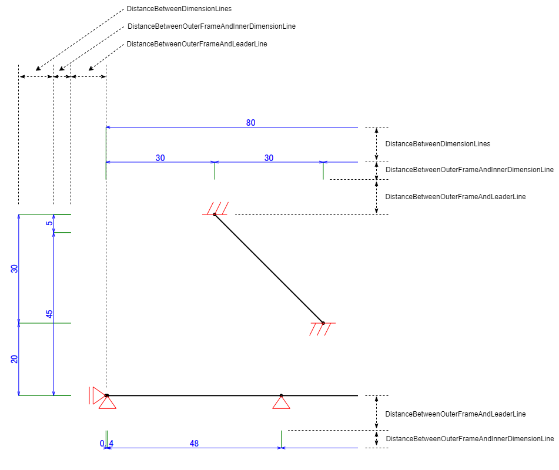

# 荷重図描画機能の追加 <!-- omit in toc -->

- 作成日：2023/4/6
- 作成者：渡邊秀雄(hwatanab4546)

---

## 目次 <!-- omit in toc -->

- [1. 作業期間](#1-作業期間)
- [2. 作業内容](#2-作業内容)
- [3. 環境](#3-環境)
- [4. JSONファイルのキーワード](#4-jsonファイルのキーワード)
- [5. PDF出力処理の流れ](#5-pdf出力処理の流れ)
- [6. 描画処理の概要](#6-描画処理の概要)
  - [6.1 支点の描画](#61-支点の描画)
  - [6.2 バネの描画](#62-バネの描画)
  - [6.3 部材寸法の描画](#63-部材寸法の描画)
  - [6.4 節点荷重と部材寸法の描画(Nodal Load)](#64-節点荷重と部材寸法の描画nodal-load)
  - [6.5 部材荷重と部材寸法の描画(Member Load)](#65-部材荷重と部材寸法の描画member-load)
  - [6.6 ポイント(pt)から部材寸法値の単位系への変換について](#66-ポイントptから部材寸法値の単位系への変換について)
  - [6.7 数値の描画について](#67-数値の描画について)
- [7. クラス概要](#7-クラス概要)
  - [7.1 部材関連](#71-部材関連)
  - [7.2 描画処理共通](#72-描画処理共通)
  - [7.3 支点の描画関連](#73-支点の描画関連)
  - [7.4 バネの描画関連](#74-バネの描画関連)
  - [7.5 寸法の描画関連](#75-寸法の描画関連)
  - [7.6 節点荷重の描画関連](#76-節点荷重の描画関連)
  - [7.7 部材荷重の描画関連](#77-部材荷重の描画関連)
- [8. 描画処理関連パラメータ](#8-描画処理関連パラメータ)
  - [8.1 共通](#81-共通)
  - [8.2 支点関連](#82-支点関連)
  - [8.3 寸法関連](#83-寸法関連)
  - [8.4 バネ関連](#84-バネ関連)
  - [8.5 節点荷重関連](#85-節点荷重関連)
  - [8.6 部材荷重関連](#86-部材荷重関連)
- [9. 条件付きコンパイルシンボル](#9-条件付きコンパイルシンボル)
- [10. 課題](#10-課題)
- [11. サンプルデータ](#11-サンプルデータ)
- [12. 参考リンク](#12-参考リンク)

---

## 1. 作業期間

- 2023/2/17(金) ~ 2023/4/6(木)

---

## 2. 作業内容

- Visual Basicのコードを参考に、荷重図を描画する機能をC#でFramePrintPDFに追加する。
- 下記3項目の設定に対応する。
  - 用紙の向き(縦・横)の設定
  - 表示段数(シングル・二段・三段・四段)、およびシングルで作成するCaseの設定
  - 軸線スケール(縦・横)の設定
- 荷重図(骨組図)を描画する機能の一部として、下記4機能を追加する。
  - 支点の描画(固定・ピン・ローラー(x方向のみ拘束)・ローラー(y方向のみ拘束))
  - バネの描画
  - 部材寸法の描画
  - 荷重寸法の描画
- 下記4項目は、今回の作業では対象外とする。
  - 杭、剛域、合成荷重、連行車両荷重、webアプリが対応していない荷重図の「マーク」
  - 節点番号の描画
  - 部材番号の描画

---

## 3. 環境

- OS：Windows 10 Home 21H2
- フレームワーク：.NET Core 3.1 および .NET 6.0
- 言語：C# 8.0
- 開発環境：Microsoft Visual Studio 2022 Community

---

## 4. JSONファイルのキーワード

- `pageOrientation`
  - 用紙向きの指定
  - 設定値
    - `Vertical` - 縦向き (デフォルト)
    - `Horiozntal` - 横向き
- `diagramInput`
  - `layout`
    - 用紙分割方法の指定
    - 軸線図はこの指定の影響を受けず、常にページ分割なしで出力される
    - 設定値
      - `Default` - ページ分割なし (デフォルト)
      - `splithorizontal` - 上下に2分割
      - `splitvertical` - 左右に2分割
      - `single` - ページ分割なし (`Default`を指定した場合と同じ)
      - `splithorizontal2` - 上下に2分割 (`splithorizontal`を指定した場合と同じ)
      - `splithorizontal3` - 上下に3分割
      - `splithorizontal4` - 上下に4分割
      - `splitvertical2` - 左右に2分割 (`splitvertical`を指定した場合と同じ)
      - `splitvertical3` - 左右に3分割
      - `splitvertical4` - 左右に4分割
  - `single_layout_cases`
    - 指定されたケース番号(荷重データのインデックス値)の荷重図をページ分割なしで出力 (ケース番号 : 0～)
    - デフォルトは空配列 (全ての荷重図がページ分割対象)
  - `output`
    - 描画対象の指定
    - デフォルトは軸線図(`axis`)と荷重図(`load`)
    - 軸線図が描画される場合は、常に先頭ページとして出力される
    - 設定値
      - `axis` - 軸線図の描画
      - `load` - 荷重図の描画

---

## 5. PDF出力処理の流れ

1. 節点情報から骨組の描画領域の左上角と右下角の座標を計算
2. 骨組の描画領域の中心座標を計算
3. 支点、部材寸法、バネ、節点荷重、部材荷重、部材寸法の描画に関する情報を`XCanvas`クラスインスタンスに保存
4. `XCanvas`クラスインスタンスに保存した情報から、支点、部材寸法、バネ、節点荷重、部材荷重、部材寸法を含む描画領域の左上角と右下角の座標を再計算
5. 描画領域の中心座標を再計算
    - 骨組の中心線がずれることを避けるため、y軸方向の中心のみを再計算する
6. 描画スケールを計算
    - 骨組の中心線がずれることを避けるため、x軸方向の描画スケールを計算する際は中心座標の左側と右側とにわけて計算する
7. PDF出力
    - 骨組の描画
    - `XCanvas`クラスインスタンスに保存した情報(支点、部材寸法、バネ、節点荷重、部材荷重、部材寸法)の描画

---

## 6. 描画処理の概要

### 6.1 支点の描画

- 描画する記号の形状と寸法は、VBアプリを参考に決定：`Sub 支点Mark()` (`KAJU_ZU23.bas`の775行目)
- VBアプリでは複数パターンが設定できるが、本作業では1パターンしか考慮しない
- 描画角度と支点の*向き*の定義
  - 0°：上向き(△)
  - 90°：左向き(◁)
  - 180°：下向き(▽)
  - 270°：右向き(▷)
- ピン(tx=1, ty=1, mz=0)
  - 形状
    - 底辺=14,高さ=10の二等辺三角形
    - 節点と三角形の頂点との間に0.35の隙間
  - 描画角度は常に0°(△)
- ローラー(tx=0, ty=1, mz=0)
  - 形状
    - 底辺=14,高さ=10の二等辺三角形 + 底面と平行に底面から3離れた長さ14の線分
    - 節点と三角形の頂点との間に0.35の隙間
  - 描画角度は常に0°(△)
- ローラー(tx=1, ty=0, mz=0)
  - 形状
    - 底辺=14,高さ=10の二等辺三角形 + 底面と平行に底面から3離れた長さ14の線分
    - 節点と三角形の頂点との間に0.35の隙間
  - 描画角度は、支点が部材の左側にある場合は270°(▷)、右側にある場合は90°(◁)
- 固定(tx=1, ty=1, mz=1)
  - 形状
    - 電子回路図のグランド(アース、接地)のような形状
  - 描画角度
    - 水平部材の場合は、支点が部材の左側にある場合は270°(▷)、右側にある場合は90°(◁)
    - 水平部材以外の場合は、支点が部材の上側にある場合は180°(▽)、下側にある場合は0°(△)
- バネ(tx>-1, ty<>0, ty<>1)
  - 形状
    - ピンの底部にバネ
  - 描画角度
    - 水平部材の場合は、支点が部材の左側にある場合は270°(▷)、右側にある場合は90°(◁)
    - 水平部材以外の場合は、支点が部材の上側にある場合は180°(▽)、下側にある場合は0°(△)

### 6.2 バネの描画

- 参考：`Sub 分布ばねMark()` (`KAJU_ZU23.bas`の1364行目)
- 軸線図にはバネは描画せず、荷重図中に描画する
- 水平部材
  - 部材の下に水平方向にバネを均等間隔で配置
  - 繰り返し間隔(pitch)の下限は「11 - -3 + 2 = 16」とする
  - 部材との間隔は、ソース上は「1.05Twip = 紙面上における1.05mm」に指定されているように見えるが、実際には6程度(バネのサイズ程度)あるように見えるので、後者とする
  - 鉛直方向のバネのサイズは6x6
  - 水平方向のバネのサイズは6x4
  - 形状は下記の通り

    ```Text
    (-3,13) - (3,13)  (5,12) (8,12) (11,12)
            /            |   /   |   /   |
    (-3,16) - (3,16)  (5,16) (8,16) (11,16)
            /
    (-3,19) - (3,19)
    ```

- 鉛直部材
  - 部材の右または左に鉛直方向にバネを均等間隔で配置
  - 繰り返し間隔(pitch)の下限は「11 - -3 + 2 = 16」とする
  - 部材中心のX座標が描画領域中心のX座標(`CenterPos.X`)より小さければ部材の左側に、それ以外は部材の右側に配置する
  - 部材との間隔は、ソース上は「紙面上で1mm」に指定されているように見えるが、実際には6程度(バネのサイズ程度)あるように見えるので、後者とする
  - 水平方向のバネのサイズは6x6
  - 鉛直方向のバネのサイズは6x4
  - 部材右側に表示する場合の形状は下記の通り

    ```Text
    (13,-3) (16,-3) (19,-3)
       |   /   |   /   |
    (13,+3) (16,+3) (19,+3)

    (12,5) - (16,5)
           /
    (12,8) - (16,8)
           /
    (12,11) - (16,11)
    ```

  - 部材左側に表示する場合の形状は下記の通り

    ```Text
    (13,-3) (16,-3) (19,-3)
       |   /   |   /   |
    (13,+3) (16,+3) (19,+3)
  
            (16,5) - (20,5)
                   /
            (16,8) - (20,8)
                   /
           (16,11) - (20,11)
    ```

### 6.3 部材寸法の描画

- 参考：`Sub s軸線寸法表示()` (`KAJYU_ZU23.bas`の13340行目)
- 参考：`Sub 寸法矢印()` (`KAJYU_ZU23.bas`の35470行目)
- 描画処理の概要
  1. 一直線に並ぶ部材から構成されるグループを作成
      - 斜材の場合は互いのベクトルを比較することになるので、ある程度の誤差は許容する
      - ベクトルの許容誤差が不適切に大きいと斜材が混じることもあり得るので注意が必要
  2. 各グループを鉛直成分と水平成分に分割する
  3. 鉛直方向のグループの中で全ての節点のy座標が他のグループの真部分集合となっているものを削除する。同様に、水平方向のグループの中で全ての節点のx座標が他のグループの真部分集合となっているものを削除する。
  4. 個々のグループの中心座標と描画領域の中心を比較して、骨組図の上下左右のどこに表示するかを決定する
      - 水平方向のグループの中心が描画領域の上下の中心にある場合は、上方向に表示
      - 鉛直方向のグループの中心が描画領域の左右の中心にある場合は、右方向に表示
  5. 鉛直方向のグループの中で全ての節点のy座標が一致するものを(描画領域右側に表示するものがあればそれを残す形で)削除する。同様に、水平方向のグループの中で全ての節点のx座標が一致するものを(描画領域上側に表示するものがあればそれを残す形で)削除する。
  6. 描画領域の上下左右それぞれについて、個々のグループの並び順(アプリ内部では`Depth`という変数名を使用)を決定する
      - 描画領域中心に近い方から遠い方に向かって1, 2, ...
      - 引き出し線と寸法線の交差を減らすため、節点数の多いグループほど中心に近い方に描画する
  7. 引き出し線を描画するためのデータを生成
  8. 寸法線(矢印の羽を含む)を描画するためのデータを生成
  9. 引き出し線と寸法線(矢印の羽を含む)を加味して描画領域(`TopLeft`と`BottomRight`)を再計算
  10. 描画スケール(`ScaleX`と`ScaleY`)を計算
  11. 描画

### 6.4 節点荷重と部材寸法の描画(Nodal Load)

- 参考：`Sub K荷重図()` (`KAJYU_ZU23.bas`の1955行目)
- 参考：`Sub K荷重図INIT_Frame()` (`KAJYU_ZU23.bas`の2080行目)
- 参考：`Sub K荷重図INIT_Frame_23()` (`KAJYU_ZU23.bas`の2520行目)
- 参考：`Sub F節点荷重()` (`KAJYU_ZU23.bas`の33825行目)
- 水平方向にかかる力(`FX`)
  - 構造座標系で右向き(x座標の大きい方)が正
  - 荷重値は前方に`H=`を付けて描画
- 鉛直方向にかかる力(`FY`)
  - 構造座標系で下向き(y座標(ver2以降は符号反転後)の小さい方)が正
  - 荷重値は前方に`P=`を付けて描画
- 力の向きを表す矢印は、力の向きの逆側から矢印が節点を指す形(矢印の先に節点がある形)で描画する
  - 矢印が部材骨組線と重なる(交差ではない)場合は、少し角度をつけて描画することで重なりを回避する
    - 参考：`test037`の`Case 2`
- モーメント(`M`)
  - 時計回りが正
  - モーメント値は前方に`M=`を付けて描画
  - 負値の場合、矢印は反時計回りに描画するが、数値は負値のまま描画

### 6.5 部材荷重と部材寸法の描画(Member Load)

- 荷重と寸法の描画座標の決定方法について
  1. 部材を、その中心を軸として水平になるように回転移動する
  2. 水平に寝かせた部材の上側に荷重と寸法を配置する
  3. 部材の中心を軸として本来の部材角度まで回転移動させる(必要に応じて部材を軸とした鏡映を追加)ことで荷重と寸法の描画座標を決定する
- 部材番号
  - `m1`だけに入力された場合は、その部材に荷重がかかる
  - `m1`と`m2`が共に正値の場合は、スタートからエンドまでの部材それぞれに荷重がかかる
  - `m1`が正で`m2`が負の場合は、スタートからエンドまでの部材を1つの部材として荷重がかかる
- `P1`と`P2`が共に0なら描画しない
- 部材荷重の種類
  - モーメント荷重(`mark=11`)
    - 荷重のかかる点を中心として、下側が開いた円弧で描画
    - 反時計回りが正
      - 荷重値が負値なら矢印は時計回り、数値は符号なしで描画
      - 荷重値が正値なら矢印は反時計回り、数値は符号なしで描画(?)
    - 数値の表示位置は荷重がかかる点の下側
      - プレフィックスなし
      - サフィックスは`kN·m`
  - 温度変化① (線膨張)(`mark=9`)
    - 部材に添って`P1`を描画(プレフィックスなし、サフィックスは`℃`)
      - 正値なら符号なし
      - 負値なら負符号つき
  - 部材方向分布荷重(`mark=2 direction="x"`)
    - 部材の骨組線に沿った部材方向の矢印付き破線で描画(描画領域の中心に近い側に描画)
    - (先頭の)部材の節点niからnjへの向きが正
      - 荷重が負値なら矢印はnjからniに向かう向き、数値は符号なしで描画
      - 荷重が正値なら矢印はniからnjに向かう向き、数値は符号なしで描画
    - 荷重値のプレフィックスは`q=`、ポストフィックスは`kN/m`
    - `P1`と`P2`が一致しない場合は「`q=P1~P2kN/m`」のように範囲形式で描画
      - `P1`と`P2`は符号なしで描画
      - `P1`と`P2`のいずれかが負値の場合は矢印は逆向き
  - 部材直角方向分布荷重(`mark=2 direction="y or z"`)
    - 矢印付きの直方体(または台形)で描画
    - (先頭の)部材の節点niからnjへの向きを反時計回りに90°回転した向きが正
      - 荷重が負値なら、矢印は時計回りに90°回転した向きに描画、数値は符号なしで描画
      - 荷重が正値なら、矢印はら反時計回りに90°回転した向きに描画、数値は負符号で描画
    - 荷重値のプレフィックスはなし、ポストフィックスは`kN`
  - 部材方向集中荷重(`mark=1 direction="x"`)
    - 荷重がかかる点に向かう矢印で描画
    - 骨組線と重なる場合は矢印を傾ける
    - (先頭の)部材の節点niからnjへの向きが正
      - 荷重が負値なら、矢印はnjからniに向かう向き、数値は符号なしで描画
      - 荷重が正値なら、矢印はniからnjに向かう向き、数値は符号なしで描画
    - 荷重値のプレフィックスはなし、ポストフィックスは`kN/m`
  - 部材直角方向集中荷重(`mark=1 direction="y or z"`)
    - 荷重がかかる点に向かう矢印で描画
    - (先頭の)部材の節点niからnjへの向きを反時計回りに90°回転した向きが正
      - 荷重が負値なら、矢印は時計回りに90°回転した向きに描画、数値は符号なしで描画
      - 荷重が正値なら、矢印はら反時計回りに90°回転した向きに描画、数値は**負符号**で描画
    - 荷重値のプレフィックスはなし、ポストフィックスは`kN`
    - 矢印の長さは荷重値の大小と連動せず一定
    - 同じ部材グループに対して部材直角方向集中荷重が複数指定されるケースがある(それぞれを積み上げる形で描画)
  - 構造座標系水平方向分布荷重(`mark=2 direction="gx"`)
    - 構造座標系の水平方向にかかる荷重は、右向き(x座標が大きくなる向き)が正
    - 構造座標系の鉛直方向にかかる荷重は、下向き(y座標(ver2以降は符号反転後)が小さくなる向き)が正
    - 荷重値のプレフィックスはなし、ポストフィックスは`kN`

### 6.6 ポイント(pt)から部材寸法値の単位系への変換について

- 本アプリでは、下記の式で計算した係数を乗ずることでポイント単位で指定された寸法値(矢印の長さなど)を部材寸法値の単位系に変換して描画している
  - 係数 = Max(部材座標系における描画領域水平方向の幅, 部材座標系における描画領域鉛直方向の幅) / (200 * 2.83465)
  - 2.83465[pt] = 1[mm]
- この係数を使用すると、200[mm]四方の用紙一杯に部材を表示する状況において、1[pt]で指定された長さが実際に用紙上の1[pt]で表現される

### 6.7 数値の描画について

- 荷重値と寸法値
  - 整数や小数点以下2桁までの値（小数点以下3桁以降が0の値）の場合、「小数第2位」まで値を表示する
  - 小数点以下3桁以降も値がある場合は、小数第4位を四捨五入して「小数第3位」までの値を表示する
  - 参考：`Function F2$()` (`KAJYU_ZU23.bas`の34645行目)
  - 例：

    |数値|描画|
    |--|--|
    |1|`1.00`|
    |1.2|`1.20`|
    |1.23|`1.23`|
    |1.234|`1.234`|
    |1.2345|`1.235`|

- 温度
  - 整数や小数点以下1桁までの値（小数点以下2桁以降が0の値）の場合、「小数第1位」まで値を表示する
  - 小数点以下2桁以降も値がある場合は、荷重値や寸法値の場合と同様に扱う
  - 参考：`Sub F温度変化9_10()` (`KAJYU_ZU23.bas`の33179行目行目)
  - 参考：`Function F1$()` (`KAJYU_ZU23.bas`の34639行目)
  - 例：

    |数値|描画|
    |--|--|
    |1|`1.0`|
    |1.2|`1.2`|
    |1.23|`1.23`|
    |1.234|`1.234`|
    |1.2345|`1.235`|

---

## 7. クラス概要

### 7.1 部材関連

- `XNode`クラス
  - 部材節点に関連する情報を保持する
    - 節点番号
    - 節点座標
    - 節点荷重情報(`IXNodalLoad`型インスタンス)のリスト
  - 支点に関する情報(`XSupport`クラスインスタンス)については、特に必要がないため保持させていない
- `XMember`クラス
  - 部材に関連する情報を保持する
    - 部材番号
    - 部材両端の部材節点の情報(`XNode`クラスインスタンス)
    - 部材の長さ
    - 部材の傾き
    - バネの情報(`XSpring`クラスインスタンス)
    - 部材が属する部材グループの情報(`XMemberGroup`クラスインスタンス)
- `XMemberGroup`クラス
  - 一直線上に並ぶ部材に関する情報を保持する
    - 部材グループに属する部材の情報(`XMember`クラスインスタンス)の一覧
    - 部材グループ両端の部材節点の情報(`XNode`クラスインスタンス)
    - 部材グループの中心座標
    - 部材グループの傾き
    - 寸法情報(部材グループに属する部材節点のx座標とy座標)
    - 部材グループの中心座標を中心として部材が水平となるように回転移動させた状態での各部材節点の座標
      - 部材荷重関連の描画は、この状態で荷重線や荷重寸法線の描画位置を決めた後、回転移動によって本来の描画位置を計算する手順で行われる
  - 部材グループに属する部材の部材荷重情報(`IXMemberLoad`型インスタンス)のリスト

### 7.2 描画処理共通

- `XDrawable`クラス
  - 支点、バネ、寸法、節点荷重および部材荷重の描画に使用される共通メソッドを定義した抽象クラス
    - 2点間の直線(矢印の有無の指定、破線パターンの指定)を登録するメソッドの定義
    - テキスト(傾斜角の指定)を登録するメソッドの定義
    - 円弧(矢印の有無の指定)を登録するメソッドの定義
  - 登録された情報を`ICanvas`型インスタンスに出力するメソッドの定義
- `ICanvas`インタフェース
  - 支点、バネ、寸法、節点荷重および部材荷重の描画に使用されるメソッドのインタフェースを定義
- `XCanvas`クラス
  - `ICanvas`インタフェースのメソッドを定義
    - 実際にPDF出力するわけではなく、描画される図形やテキストの情報をリストに格納して保持する
  - リストに格納された図形やテキストの情報に描画スケール(`DiagramFrame.ScaleX`と`DiagramFrame.ScaleY`)や中心座標(`DiagramFrame.CenterPos`)を反映させて実際にPDF出力を行うメソッドを定義

### 7.3 支点の描画関連

- `XSupport`クラス
  - 個々の支点の描画情報を保持するクラス
- `DiagramSupport`クラス
  - 全ての支点を描画する
  - コンストラクタ
    - 全ての支点について、個々の支点に対応する`XSupport`クラスインスタンスを生成
  - `AdjustDiagramRect()`メソッド
    - 支点の描画データを含む領域の左上・右下の座標を計算
  - `Print()`メソッド
    - 支点の描画情報に描画スケール(`DiagramFrame.ScaleX`と`DiagramFrame.ScaleY`)や中心座標(`DiagramFrame.CenterPos`)を反映させて実際にPDF出力

### 7.4 バネの描画関連

- `XSpring`クラス
  - 部材ごとのバネの描画情報を保持するクラス
- `DiagramSpring`クラス
  - 全ての部材のバネを描画する
  - コンストラクタ
    - 全てのバネについて、個々のバネに対応する`XSpring`クラスインスタンスを生成
    - 生成した`XSpring`クラスインスタンスのそれぞれを関連する`XMember`クラスインスタンスに登録
      - `XMember`クラスインスタンスに登録したバネの情報は、バネ、節点荷重および部材荷重の描画が重なり合うのを回避するために使用される
  - `AdjustDiagramRect()`メソッド
    - バネの描画データを含む領域の左上・右下の座標を計算
  - `Print()`メソッド
    - バネの描画情報に描画スケール(`DiagramFrame.ScaleX`と`DiagramFrame.ScaleY`)や中心座標(`DiagramFrame.CenterPos`)を反映させて実際にPDF出力

### 7.5 寸法の描画関連

- `DiagramDimension`クラス
  - 骨組図の寸法引き出し線、寸法線および寸法値を描画する
  - コンストラクタ
    - 寸法引き出し線、寸法線および寸法値の描画に関する情報を`XDrawable`クラスインスタンスに登録
  - `AdjustDiagramRect()`メソッド
    - 全ての寸法引き出し線、寸法線および寸法値の描画データを含む領域の左上・右下の座標を計算
  - `Print()`メソッド
    - 全ての寸法引き出し線、寸法線および寸法値の描画情報に描画スケール(`DiagramFrame.ScaleX`と`DiagramFrame.ScaleY`)や中心座標(`DiagramFrame.CenterPos`)を反映させて実際にPDF出力

### 7.6 節点荷重の描画関連

- `IXNodalLoad`インタフェース
  - 節点荷重の描画情報を保持するクラス(`XHorizontalNodalLoad`、`XVerticalNodalLoad`、`XMomentNodalLoad`)の共通インタフェース定義
- `XHorizontalNodalLoad`クラス
  - 水平方向の節点荷重の描画情報を保持するクラス
- `XVerticalNodalLoad`クラス
  - 鉛直方向の節点荷重の描画情報を保持するクラス
- `XMomentNodalLoad`クラス
  - モーメント荷重の描画情報を保持するクラス
- `DiagramNodalLoad`クラス
  - 全ての節点荷重と荷重寸法線を描画する
  - コンストラクタ
    - 全ての節点荷重について、個々の節点荷重に対応する`IXNodalLoad`型インスタンスを生成
    - 生成した`IXNodalLoad`型インスタンスのそれぞれを関連する`XNode`クラスインスタンスに登録
      - `XNode`クラスインスタンスに登録した節点荷重の情報は、バネ、節点荷重および部材荷重の描画が重なり合うのを回避するために使用される
  - `AdjustDiagramRect()`メソッド
    - 全ての節点荷重の描画データを含む領域の左上・右下の座標を計算
  - `Print()`メソッド
    - 全ての節点荷重の描画情報に描画スケール(`DiagramFrame.ScaleX`と`DiagramFrame.ScaleY`)や中心座標(`DiagramFrame.CenterPos`)を反映させて実際にPDF出力

### 7.7 部材荷重の描画関連

- `IXMemberLoad`インタフェース
  - 部材荷重の描画情報を保持するクラス(`XMemberLoad_XXX`)の共通インタフェース定義
- `XMemberLoad_1x`クラス
  - 部材方向集中荷重の描画情報を保持するクラス
- `XMemberLoad_1y`クラス
  - 部材直角方向集中荷重の描画情報を保持するクラス
- `XMemberLoad_2x`クラス
  - 部材方向分布荷重の描画情報を保持するクラス
- `XMemberLoad_2y`クラス
  - 部材直角方向分布荷重の描画情報を保持するクラス
- `XMemberLoad_9`クラス
  - 温度変化①(線膨張)の描画情報を保持するクラス
- `XMemberLoad_11z`クラス
  - モーメント荷重の描画情報を保持するクラス
- `XMemberLoad_2gx`クラス
  - 構造座標系水平方向分布荷重の描画情報を保持するクラス
- `DiagramMemberLoad`クラス
  - 全ての部材荷重と荷重寸法線を描画する
  - コンストラクタ
    - 全ての部材荷重について、個々の部材荷重に対応する`IXMemberLoad`型インスタンスを生成
    - 生成した`IXMemberLoad`型インスタンスのそれぞれを関連する`XMemberGroup`クラスインスタンスに登録
      - `XMemberGroup`クラスインスタンスに登録した部材荷重の情報は、バネや節点荷重および部材荷重の描画が重なり合うのを回避するために使用される
  - `AdjustDiagramRect()`メソッド
    - 全ての部材荷重の描画データを含む領域の左上・右下の座標を計算
  - `Print()`メソッド
    - 全ての部材荷重の描画情報に描画スケール(`DiagramFrame.ScaleX`と`DiagramFrame.ScaleY`)や中心座標(`DiagramFrame.CenterPos`)を反映させて実際にPDF出力

---

## 8. 描画処理関連パラメータ

### 8.1 共通

|名前|型|パラメータ値|説明|
|--|--|--|--|
|`XDrawable.defaultArrowHeadLength`|`double`|10|矢印の羽の長さ(単位はポイント)|
|`XDrawable.defaultArrowHeadAngle`|`double`|30|矢印の羽の開き角度(単位は度)|

### 8.2 支点関連

|名前|型|パラメータ値|説明|
|--|--|--|--|
|`DiagramSupport.SupportTextColor`|`double`|`XBrushes.Red`|支点関連テキストの描画色|
|`DiagramSupport.SupportPenColor`|`double`|`XColors.Red`|支点の描画色|
|`DiagramSupport.SupportPenWidth`|`double`|0.1|支点の描画線の太さ(単位はポイント)|
|`XSupport.PinTopGap`|`double`|0.35|部材節点とピン支点の頂点の間隔(単位はポイント)|
|`XSupport.PinHeight`|`double`|10|ピン支点の高さ(単位はポイント)|
|`XSupport.PinWidth`|`double`|14|ピン支点の底辺の長さ(単位はポイント)|
|`XSupport.TopGap`|`double`|0.35|部材節点とローラー支点の頂点の間隔(単位はポイント)|
|`XSupport.RollerHeight`|`double`|10|ローラー支点の上側三角形の高さ(単位はポイント)|
|`XSupport.RollerWidth`|`double`|14|ローラー支点の上側三角形の底辺の長さ(単位はポイント)|
|`XSupport.RollerUnderlineGap`|`double`|3|ローラー支点の上側三角形の底辺と下線の間隔(単位はポイント)|
|`XSupport.FixedParams`|`double[,]`|(下図参照)|固定支点を構成する4直線の始点と終点の相対座標の集合|
|`XSupport.SpringParams`|`double[,]`|(下図参照)|バネ支点を構成する7直線の始点と終点の相対座標の集合|

- 固定支点を構成する4直線の始点と終点の相対座標

  ```Text
  (-10,0) ---------------------- (10,0)
      (-6, 0)   (0, 0)    (6, 0)
        /         /        /
  (-11, -10)  (-5, -10)  (1, -10)
  ```

- バネ支点を構成する7直線の始点と終点の相対座標

  ```Text
            (0,-0.35)
          /          \
  (-7,-10.35) ---- (7,-10.35)
  (-7,-13.35) ---- (7,-13.35)
               /
  (-7,-16.35) ---- (7,-16.35)
               /
  (-7,-19.35) ---- (7,-19.35)
  ```

### 8.3 寸法関連

|名前|型|パラメータ値|説明|
|--|--|--|--|
|`DiagramDimension.DimensionTextColor`|`double`|`XBrushes.Blue`|寸法テキストの描画色|
|`DiagramDimension.DimensionPenColor`|`double`|`XColors.Blue`|引き出し線と寸法線の描画色|
|`DiagramDimension.DimensionPenWidth`|`double`|0.1|引き出し線と寸法線の太さ(単位はポイント)|
|`DiagramDimension.DistanceBetweenOuterFrameAndLeaderLine`|`double`|10|部材と引き出し線の間隔(単位はポイント)|
|`DiagramDimension.DistanceBetweenOuterFrameAndInnerDimensionLine`|`double`|10|描画領域の中心に一番近い引き出し線の長さ(単位はポイント)|
|`DiagramDimension.DistanceBetweenDimensionLines`|`double`|10|寸法線と寸法線の間隔(単位はポイント)|
|`DiagramDimension.DistanceBetweenDimensionLineAndText`|`double`|0.5|寸法線とテキスト下端の間隔(単位はポイント)|

- 寸法線の例

  

### 8.4 バネ関連

|名前|型|パラメータ値|説明|
|--|--|--|--|
|`DiagramSpring.SpringTextColor`|`double`|`XBrushes.Red`|バネ関連テキストの描画色|
|`DiagramSpring.SpringPenColor`|`double`|`XColors.Red`|バネの描画色|
|`DiagramSpring.SpringPenWidth`|`double`|0.1|バネの描画線の太さ(単位はポイント)|
|`DiagramSpring.HorizontalSpringGap`|`double`|6|(水平部材用)部材とバネの間隔(単位はポイント)|
|`DiagramSpring.HorizontalSpringPitch`|`double`|16|(水平部材用)バネを並べて表示する際のバネ間の最小間隔(単位はポイント)|
|`DiagramSpring.HorizontalSpringParams1`|`double[]`|(下図参照)|(水平部材用)縦向きのバネを構成する節点のx座標とy座標を交互に並べたもの|
|`DiagramSpring.HorizontalSpringParams2`|`double[]`|(下図参照)|(水平部材用)横向きのバネを構成する節点のx座標とy座標を交互に並べたもの|
|`DiagramSpring.VerticalLeftSpringGap`|`double`|6|(鉛直部材左側表示用)部材とバネの間隔(単位はポイント)|
|`DiagramSpring.VerticalLeftSpringPitch`|`double`|16|(鉛直部材左側表示用)バネを並べて表示する際のバネ間の最小間隔(単位はポイント)|
|`DiagramSpring.VerticalLeftSpringParams1`|`double[]`|(下図参照)|(鉛直部材左側表示用)縦向きのバネを構成する節点のx座標とy座標を交互に並べたもの|
|`DiagramSpring.VerticalLeftSpringParams2`|`double[]`|(下図参照)|(鉛直部材左側表示用)横向きのバネを構成する節点のx座標とy座標を交互に並べたもの|
|`DiagramSpring.VerticalRightSpringGap`|`double`|6|(鉛直部材右側表示用)部材とバネの間隔(単位はポイント)|
|`DiagramSpring.VerticalRightSpringPitch`|`double`|16|(鉛直部材右側表示用)バネを並べて表示する際のバネ間の最小間隔(単位はポイント)|
|`DiagramSpring.VerticalRightSpringParams1`|`double[]`|(下図参照)|(鉛直部材右側表示用)縦向きのバネを構成する節点のx座標とy座標を交互に並べたもの|
|`DiagramSpring.VerticalRightSpringParams2`|`double[]`|(下図参照)|(鉛直部材右側表示用)横向きのバネを構成する節点のx座標とy座標を交互に並べたもの|

- (水平部材用)バネを構成する節点の相対座標

  ```Text
  (-3,13) - (3,13)  (5,12) (8,12) (11,12)
          /           |   /  |   /   |
  (-3,16) - (3,16)  (5,16) (8,16) (11,16)
          /
  (-3,19) - (3,19)
  ```

- (鉛直部材左側表示用)バネを構成する節点の相対座標

  ```Text
  (13,-3) (16,-3) (19,-3)
     |   /   |   /   |
  (13,+3) (16,+3) (19,+3)

          (16,5) - (20,5)
                 /
          (16,8) - (20,8)
                 /
         (16,11) - (20,11)
  ```

- (鉛直部材右側表示用)バネを構成する節点の相対座標

  ```Text
  (13,-3) (16,-3) (19,-3)
     |   /   |   /   |
  (13,+3) (16,+3) (19,+3)

  (12,5) - (16,5)
         /
  (12,8) - (16,8)
         /
  (12,11) - (16,11)
  ```

### 8.5 節点荷重関連

|名前|型|パラメータ値|説明|
|--|--|--|--|
|`DiagramNodalLoad.NodalLoadTextColor`|`double`|`XBrushes.Gold`|節点荷重関連テキストの描画色|
|`DiagramNodalLoad.NodalLoadPenColor`|`double`|`XColors.Gold`|節点荷重の描画色|
|`DiagramNodalLoad.NodalLoadPenWidth`|`double`|0.1|節点荷重の描画線の太さ(単位はポイント)|
|`XHorizontalNodalLoad.ArrowHeadDistance`|`double`|10|(水平荷重または鉛直荷重用)部材節点と荷重矢印先頭の間隔(単位はポイント)|
|`XHorizontalNodalLoad.ArrowBodyLength`|`double`|60|(水平荷重または鉛直荷重用)荷重矢印本体の長さ(単位はポイント)|
|`XHorizontalNodalLoad.DistanceBetweenArrowHeadAndTextHead`|`double`|10|(水平荷重または鉛直荷重用)部材矢印先端と荷重値テキスト左端(または右端)の間隔(単位はポイント)|
|`XHorizontalNodalLoad.DistanceBetweenArrowAndTextBottom`|`double`|2|(水平荷重または鉛直荷重用)部材矢印と荷重値テキスト下端の間隔(単位はポイント)|
|`XHorizontalNodalLoad.TiltAngle`|`double`|10|(水平荷重または鉛直荷重用)骨組線と部材荷重矢印が重なる際に部材荷重矢印を傾ける角度(単位は度)|
|`XMomentNodalLoad.ArcRadius`|`double`|20|(モーメント用)モーメント円弧の半径(単位は度)|
|`XMomentNodalLoad.ArcStartAngle`|`double`|-45|(モーメント用)モーメント円弧の描画開始角度(3時の方向を0として反時計回りが正)(単位は度)|
|`XMomentNodalLoad.ArcSweepAngle`|`double`|270|(モーメント用)モーメント円弧の描画開始から終了までの角度(反時計回りが正)(単位は度)|
|`XMomentNodalLoad.DistanceBetweenArrowAndTextBottom`|`double`|2|(モーメント用)モーメント円弧と荷重値テキストの間隔(単位はポイント)|

### 8.6 部材荷重関連

|名前|型|パラメータ値|説明|
|--|--|--|--|
|`DiagramMemberLoad.MemberLoadTextColor`|`double`|`XBrushes.Gold`|部材荷重関連テキストの描画色|
|`DiagramMemberLoad.MemberLoadPenColor`|`double`|`XColors.Gold`|部材荷重と部材荷重寸法線の描画色|
|`DiagramMemberLoad.MemberLoadPenWidth`|`double`|0.1|部材荷重と部材荷重寸法線の描画線の太さ(単位はポイント)|
|`DiagramMemberLoad.DistanceBetweenMemberAndMemberLoad`|`double`|15|部材と部材荷重の間隔(単位はポイント)|
|`DiagramMemberLoad.DistanceBetweenDrawables`|`double`|10|部材荷重と部材荷重寸法の間隔(単位はポイント)|
|`XMemberLoad_1x.DistanceBetweenMemberAndArrowHead`|`double`|5|(部材方向集中荷重用)部材と荷重矢印先端の間隔(単位はポイント)|
|`XMemberLoad_1x.ArrowLength`|`double`|40|(部材方向集中荷重用)荷重矢印本体の長さ(単位はポイント)|
|`XMemberLoad_1x.DistanceBetweenArrowHeadAndTextHead`|`double`|10|(部材方向集中荷重用)荷重矢印先端と荷重テキスト左端または右端の間隔(単位はポイント)|
|`XMemberLoad_1x.TiltAngle`|`double`|10|(部材方向集中荷重用)骨組に対する荷重線の傾斜角度(単位は度)|
|`XMemberLoad_1x.LeaderLineLength`|`double`|10|(部材方向集中荷重用)荷重と荷重寸法引き出し線の間隔(単位はポイント)|
|`XMemberLoad_1y.MemberLoadHeight`|`double`|40|(部材直角方向集中荷重用)荷重矢印本体の長さ(単位はポイント)|
|`XMemberLoad_1y.DistanceBetweenArrowHeadAndText`|`double`|5|(部材直角方向集中荷重用)荷重矢印先端と荷重テキスト左端または右端の間隔(単位はポイント)|
|`XMemberLoad_1y.LeaderLineLength`|`double`|10|(部材直角方向集中荷重用)荷重と荷重寸法引き出し線の間隔(単位はポイント)|
|`XMemberLoad_2x.ArrowLength`|`double`|60|(部材方向分布荷重用)荷重矢印本体の長さ(単位はポイント)|
|`XMemberLoad_2x.DistanceBetweenArrowAndText`|`double`|2|(部材方向分布荷重用)荷重矢印先端と荷重テキスト左端または右端の間隔(単位はポイント)|
|`XMemberLoad_2x.DashPattern`|`double[]`|{ 40, 10, }|(部材方向分布荷重用)破線パターン(単位はポイント)|
|`XMemberLoad_2y.MaxHeightOfMemberLoad`|`double`|40|(部材直角方向分布荷重用)部材直角方向分布荷重の最大値に対応する荷重矢印本体の長さ(単位はポイント)|
|`XMemberLoad_2y.MinimumInterval`|`double`|20|(部材直角方向分布荷重用)荷重矢印間隔の最小値(単位はポイント)|
|`XMemberLoad_2y.DistanceBetweenLoadAndText`|`double`|1|(部材直角方向分布荷重用)荷重と荷重テキスト上端または下端の間隔(単位はポイント)|
|`XMemberLoad_2y.AdditionalDistanceBetweenLoadAndDimension`|`double`|10|(部材直角方向分布荷重用)荷重テキストと荷重寸法線の重なりを軽減するための間隔(単位はポイント)|
|`XMemberLoad_2y.LeaderLineLength`|`double`|10|(部材直角方向分布荷重用)荷重と荷重寸法引き出し線の間隔(単位はポイント)|
|`XMemberLoad_2y.RaisingHeight`|`double`|10|(部材直角方向分布荷重用)隣接する荷重テキストの重複を回避するための表示位置の底上げ量(単位はポイント)|
|`XMemberLoad_9.DistanceBetweenMemberAndTextBottom`|`double`|3|(温度変化①(線膨張)用)部材と荷重テキスト下端の間隔(単位はポイント)|
|`XMemberLoad_11.ArcRadius`|`double`|10|(モーメント荷重用)モーメント円弧の半径(単位は度)|
|`XMemberLoad_11.ArcStartAngle`|`double`|-45|(モーメント荷重用)モーメント円弧の描画開始角度(3時の方向を0として反時計回りが正)(単位は度)|
|`XMemberLoad_11.ArcSweepAngle`|`double`|270|(モーメント荷重用)モーメント円弧の描画開始から終了までの角度(反時計回りが正)(単位は度)|
|`XMemberLoad_11.DistanceBetweenCenterAndTextHead`|`double`|`ArcRadius` * sin(45°)|(モーメント荷重用)モーメント円弧中心と荷重値テキストの間隔(単位はポイント)|
|`XMemberLoad_11.LeaderLineLength`|`double`|10|(モーメント荷重用)荷重と荷重寸法引き出し線の間隔(単位はポイント)|
|`XMemberLoad_2gx.MaxHeightOfMemberLoad`|`double`|40|(構造座標系水平方向分布荷重用)構造座標系水平方向分布荷重の最大値に対応する荷重矢印本体の長さ(単位はポイント)|
|`XMemberLoad_2gx.MinimumInterval`|`double`|20|(構造座標系水平方向分布荷重用)荷重矢印間隔の最小値(単位はポイント)|
|`XMemberLoad_2gx.DistanceBetweenLoadAndText`|`double`|1|(構造座標系水平方向分布荷重用)荷重と荷重テキスト上端または下端の間隔(単位はポイント)|
|`XMemberLoad_2gx.LeaderLineLength`|`double`|10|(構造座標系水平方向分布荷重用)荷重と荷重寸法引き出し線の間隔(単位はポイント)|
|`XMemberLoad_2gx.RaisingHeight`|`double`|10|(構造座標系水平方向分布荷重用)隣接する荷重テキストの重複を回避するための表示位置の底上げ量(単位はポイント)|

---

## 9. 条件付きコンパイルシンボル

- `DRAWS_DRAWING_FRAME`
  - `DiagramFrame.cs`ファイル先頭の「`#define DRAWS_DRAWING_FRAME`」を有効にすると、描画領域を囲む2重の枠がPDF出力されます。
  - 外側の枠は本来のareaSizeの領域に該当し、内側の枠は外枠の領域を90%に縮小したものです。
  - アプリは、この内側の枠に図形とテキストが納まるように処理を行っています。
- `DRAWS_TEXTBOXES`
  - `XDrawable.cs`ファイル先頭の「`define DRAWS_TEXTBOXES`」を有効にすると、荷重値や寸法値などのテキスト周りに小さな四角形が描画されるようになります。
  - この四角形は、`XGraphics.MeasureString()`メソッドを使って取得した、その時点でのテキストの描画サイズを示しており、アプリはこの四角形のサイズを使用してテキストと他との重なりを回避したり、描画スケールの調整を行っています。

---

## 10. 課題

- 描画される図形は描画スケールに応じて拡大/縮小されますが、荷重値や寸法値などのテキストは描画スケールとは無関係に常に一定の大きさで描画されます。このため、用紙分割した場合など、描画スケールの影響が大きく現れる状況では、テキストの描画が他と重なってしまったり、あるいは本来の描画領域から大きくはみ出るケースがあります。
  - 現状は、描画領域からのテキストのはみ出しを軽減するため、描画領域のサイズを本来の90%に縮小しています。
- 現状は、PDF出力に関する情報が一旦`XDrawable`に蓄積された後で`ICanvas/XCanvas`に移し替えられるようになっています。処理時間が少し長くなったりメモリ使用量が若干増えるといったことの他に特に害はないと思いますが、2段階に分けて出力する必要性はないため、両者をまとめて単純化した方がいいかもしれません。

---

## 11. サンプルデータ

- `test036_荷重図_斜材データ.json`
  - 斜材の構造座標系水平方向の分布荷重
  - 斜材の部材方向の分布荷重(寸法線あり)
  - 斜材の部材直角方向の分布荷重
- `test037_荷重図_節点荷重データ.json`
  - 鉛直方向の節点荷重
    - 矢印が部材骨組と重なる場合は、部材横に斜め矢印を描画
  - 水平方向の節点荷重
  - 節点荷重のモーメント(矢印は負なら反時計回りに、正なら時計回りに描画)
  - 鉛直部材の部材方向の部材荷重(部材方向分布荷重)
    - 矢印付き破線で描画
  - 鉛直部材の部材直角方向の部材荷重(部材直角方向分布荷重)
- `test038_荷重図_要素荷重データ_1.json`
  - `L1="-0.000"`で`L2`が負値のケースあり
- `test039_荷重図_要素荷重データ_2.json`
  - 水平部材の部材直角方向の分布荷重
  - 鉛直部材の部材方向の分布荷重
- `test040_荷重図_要素荷重データ_3.json`
  - 水平部材の部材直角方向の分布荷重
- `test040a_荷重図_要素荷重データ_3.json`
  - hwatanab4546が捏造した支点描画確認のためのサンプル
  - 荷重図は表示できない(と思う)
- `test041_マーク確認用（1y, 1x, 11）.json`
  - 部材直角方向集中荷重
  - 部材方向集中荷重
  - 部材方向分布荷重
  - モーメント荷重
- `test042_マーク確認用（9）.json`
  - 部材直角方向集中荷重
  - 部材方向集中荷重
  - 部材直角方向分布荷重
  - 部材方向分布荷重
  - 温度変化① (線膨張)
  - 水平方向の節点荷重(右向き)

---

## 12. 参考リンク

- [draw.io](https://app.diagrams.net/)
  - ブラウザから利用できる作図ツール
  - 拡張子`.drawio`を持つファイルは、この作図ツールの保存データです
- [Unicode 数学記号 - CyberLibrarian](https://www.asahi-net.or.jp/~ax2s-kmtn/ref/unicode/u2200.html)
  - `kN·m`の半角ドット(&#x00B7;)：`U+00B7`
- [破線を描く - .NET Tips (VB.NET,C#...)](https://dobon.net/vb/dotnet/graphics/drawdash.html)
  - 破線パターン(ダッシュパターン)についての説明が記載されています
