# 7. 材料非線形モデル

## 7.1. バイリニア（標準型）

骨格曲線がバイリニアでMasingの規則に従います。

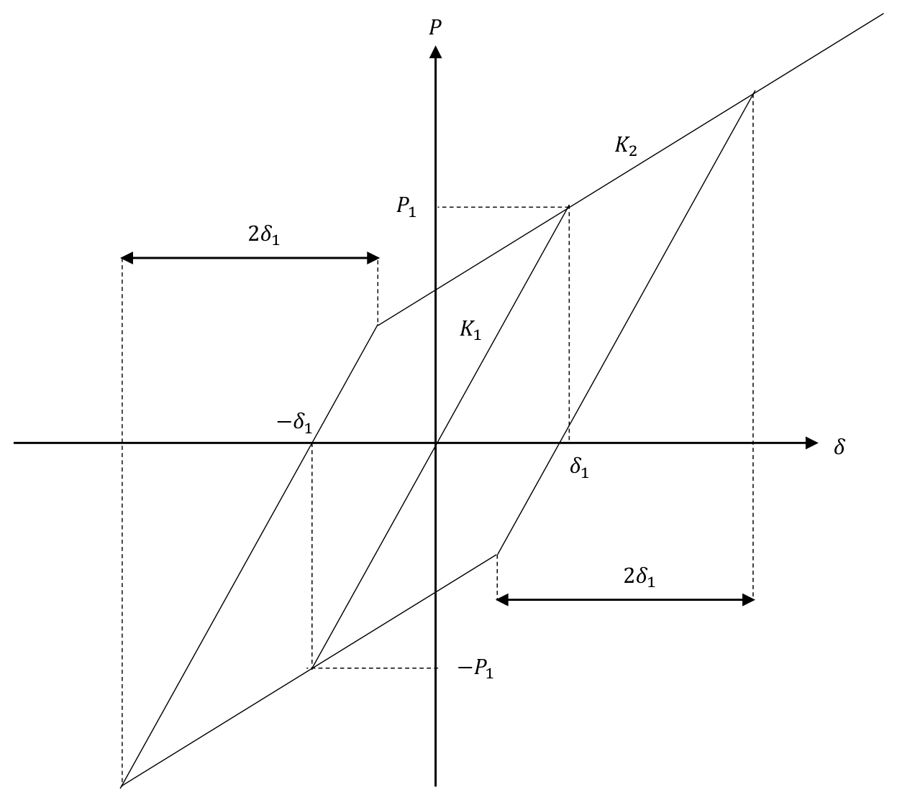

**骨格曲線パラメータ：**
- $\delta_1$：第1折れ点変位
- $F_1$：第1折れ点荷重
- $K_1$：初期剛性
- $K_2$：第2勾配

**履歴則：**
- Masingの規則に従い、除荷・再載荷時は骨格曲線を2倍に拡大した曲線上を移動します。

---

## 7.2. バイリニア（非対称逆行型）

骨格曲線は下図のようになり、履歴曲線は描かずに骨格曲線上を動きます。

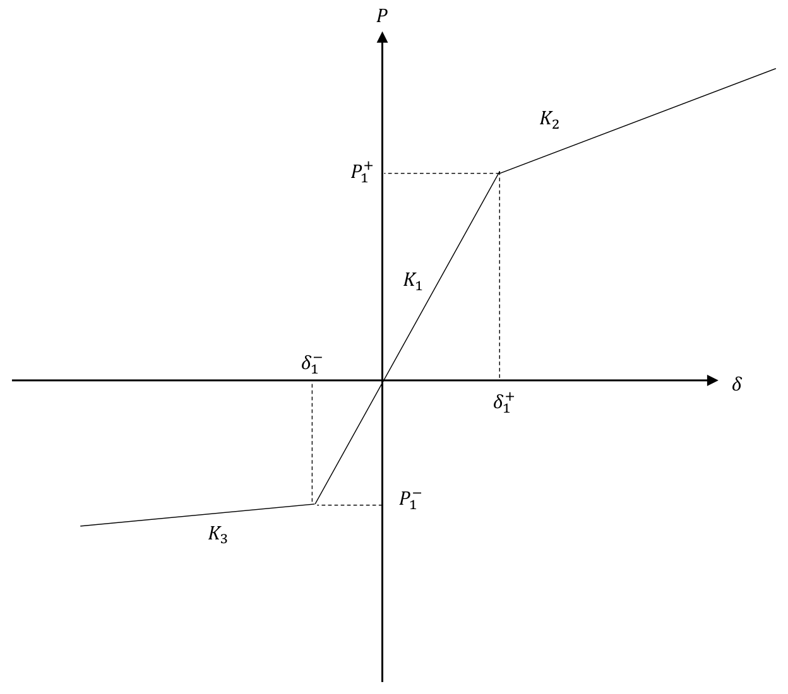

**骨格曲線パラメータ：**
- $\delta_1$：正側第1折れ点変位
- $-\delta_1$：負側第1折れ点変位
- $F_1$：正側第1折れ点荷重
- $-F_1$：負側第1折れ点荷重
- $K_1$：初期剛性
- $K_2$：正側第2勾配
- $K_3$：負側第2勾配

---

## 7.3. バイリニア（非対称ループ）

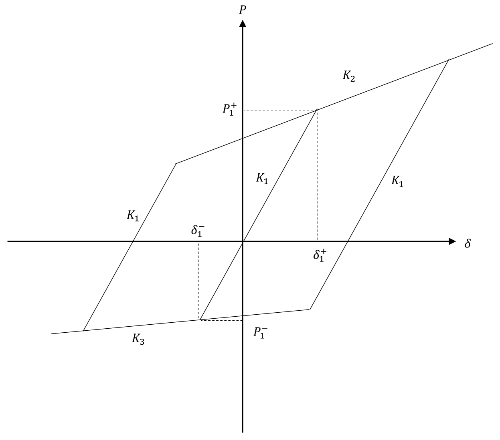

**骨格曲線パラメータ：**
- $\delta_1$：正側第1折れ点変位
- $-\delta_1$：負側第1折れ点変位
- $F_1$：正側第1折れ点荷重
- $-F_1$：負側第1折れ点荷重
- $K_1$：初期剛性
- $K_2$：正側第2勾配
- $K_3$：負側第2勾配

---

## 7.4. バイリニア（非対称スリップ）

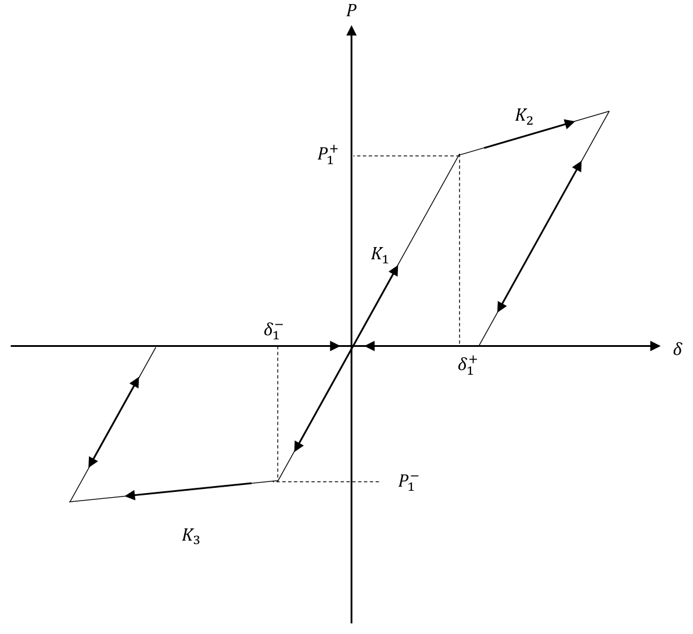

**骨格曲線パラメータ：**
- $\delta_1$：正側第1折れ点変位
- $-\delta_1$：負側第1折れ点変位
- $F_1$：正側第1折れ点荷重
- $-F_1$：負側第1折れ点荷重
- $K_1$：初期剛性
- $K_2$：正側第2勾配
- $K_3$：負側第2勾配

---

## 7.5. トリリニア（標準型）

骨格曲線がトリリニアでMasingの規則に従います。

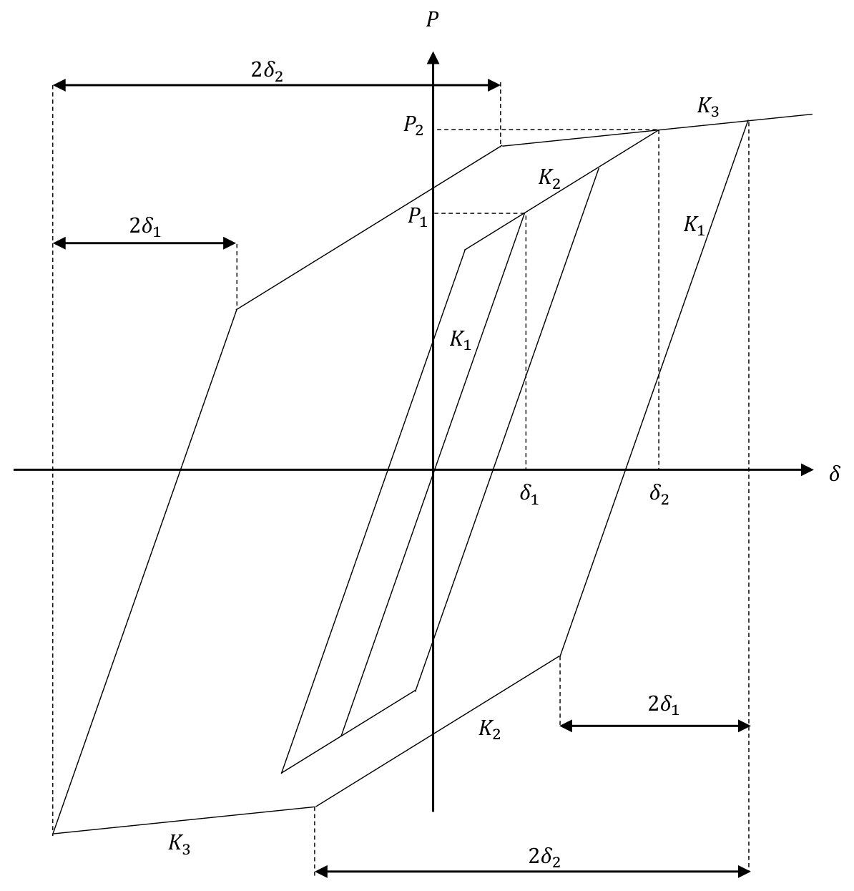

**骨格曲線パラメータ：**
- $\delta_1$：第1折れ点変位
- $\delta_2$：第2折れ点変位
- $F_1$：第1折れ点荷重
- $F_2$：第2折れ点荷重
- $K_1$：初期剛性
- $K_2$：第2勾配
- $K_3$：第3勾配

**履歴則：**
- Masingの規則に従い、除荷・再載荷時は骨格曲線を2倍に拡大した曲線上を移動します。

---

## 7.6. トリリニア（最大点指向型）

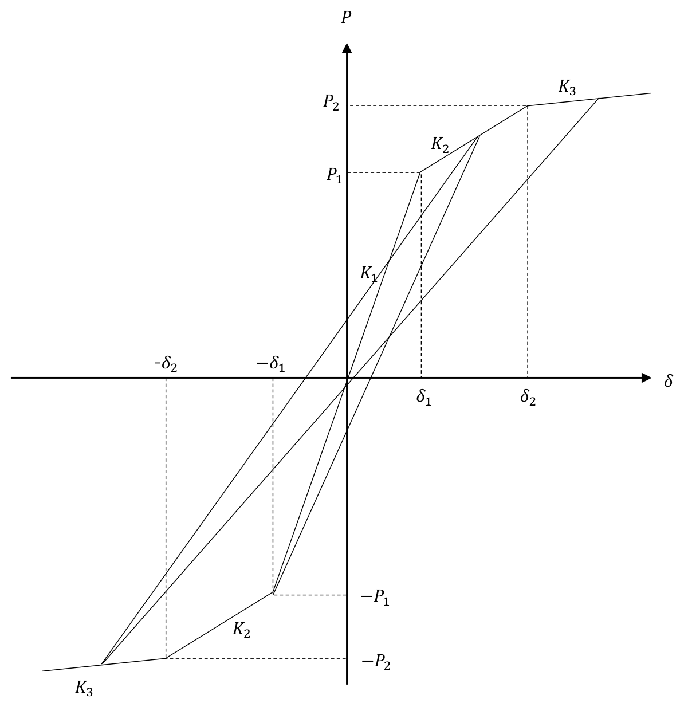

**骨格曲線パラメータ：**
- $\delta_1$：第1折れ点変位
- $\delta_2$：第2折れ点変位
- $F_1$：第1折れ点荷重
- $F_2$：第2折れ点荷重
- $K_1$：初期剛性
- $K_2$：第2勾配
- $K_3$：第3勾配
- $-\delta_1$, $-\delta_2$：負側折れ点変位
- $-F_1$, $-F_2$：負側折れ点荷重

---

## 7.7. トリリニア（原点指向型）

骨格曲線はトリリニアです。

**履歴ルール：**

1. $|\delta_{max}| < \delta_1$ の場合、原点を通る勾配 $K_1$ の直線上を動きます。

2. $\delta$ が $\delta_1$ を超えた場合は骨格曲線上の第2勾配 $K_2$ の直線上を、$\delta$ が $\delta_2$ を超えた場合は骨格曲線上の第3勾配 $K_3$ の直線上を進みます。
   - この直線から戻って反対方向に進む場合は、原点を目指します。
   - 原点を目指す直線から戻って反対方向に進む場合は、同じ直線上を戻ります。

3. 復元力0を超えると勾配は変化せず、反対側の $|\delta_{max}|$ を目指します。

4. $|\delta_{max}|$ を超えると、直線は骨格曲線上を進みます。

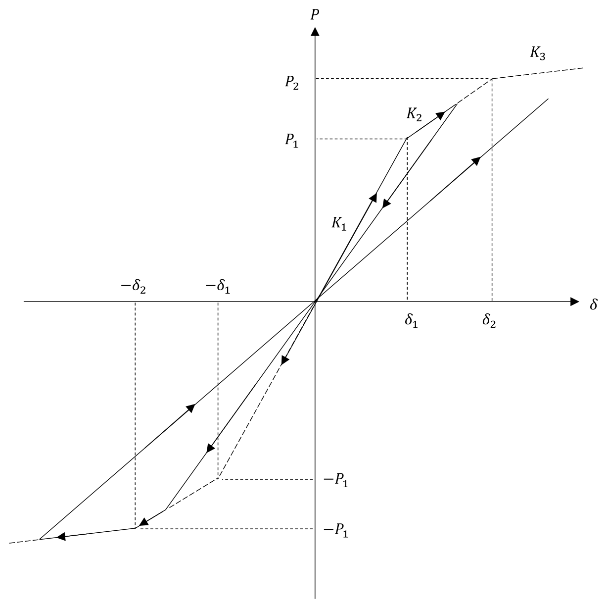

---

## 7.8. トリリニア（原点・最大点指向型）

骨格曲線はトリリニアです。

**履歴ルール：**

1. $|\delta_{max}| < \delta_1$ の場合、原点を通る勾配 $K_1$ の直線上を動きます。

2. $\delta$ が $\delta_1$ を超えた場合は骨格曲線上の第2勾配 $K_2$ の直線上を、$\delta$ が $\delta_2$ を超えた場合は骨格曲線上の第3勾配 $K_3$ の直線上を進みます。
   - この直線から戻って反対方向に進む場合は、原点を目指します。
   - 原点を目指す直線から戻って反対方向に進む場合は、同じ直線上を戻ります。

3. 復元力0を超えると、直線は反対側の最大変形点 $\delta_{max}$ を目指します。

4. 反対側の最大変形点 $\delta_{max}$ を超えると、骨格曲線上を進みます。

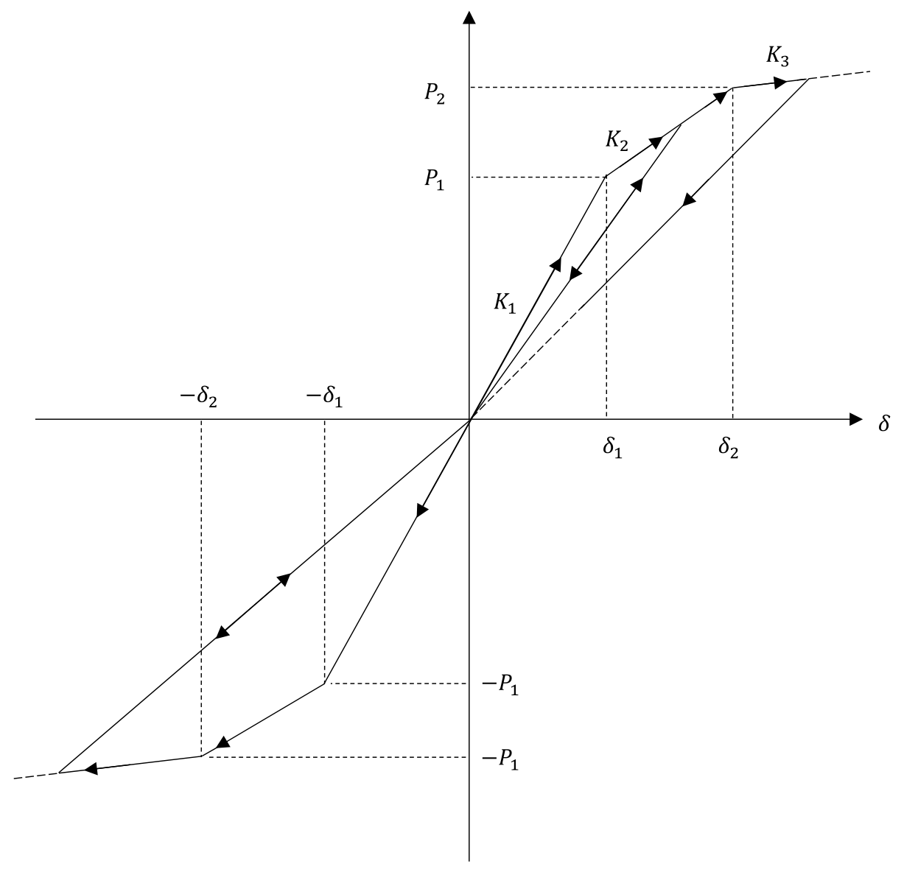

---

## 7.9. トリリニア（原点指向・鉄道標準型）

骨格曲線はトリリニアです。

**履歴ルール：**

1. $|\delta_{max}| < \delta_1$ の場合、原点を通る勾配 $K_1$ の直線上を動きます。

2. $\delta$ が $\delta_1$ を超えた場合は骨格曲線上の第2勾配 $K_2$ の直線上を、$\delta$ が $\delta_2$ を超えた場合は骨格曲線上の第3勾配 $K_3$ の直線上を進みます。
   - この直線から戻って反対方向に進む場合は、原点を目指します。
   - 原点を目指す直線から戻って反対方向に進む場合は、同じ直線上を戻ります。

3. 復元力0を超えると、直線は反対側の第一折れ点 $\delta_1$ を目指し、骨格曲線上を動きます。

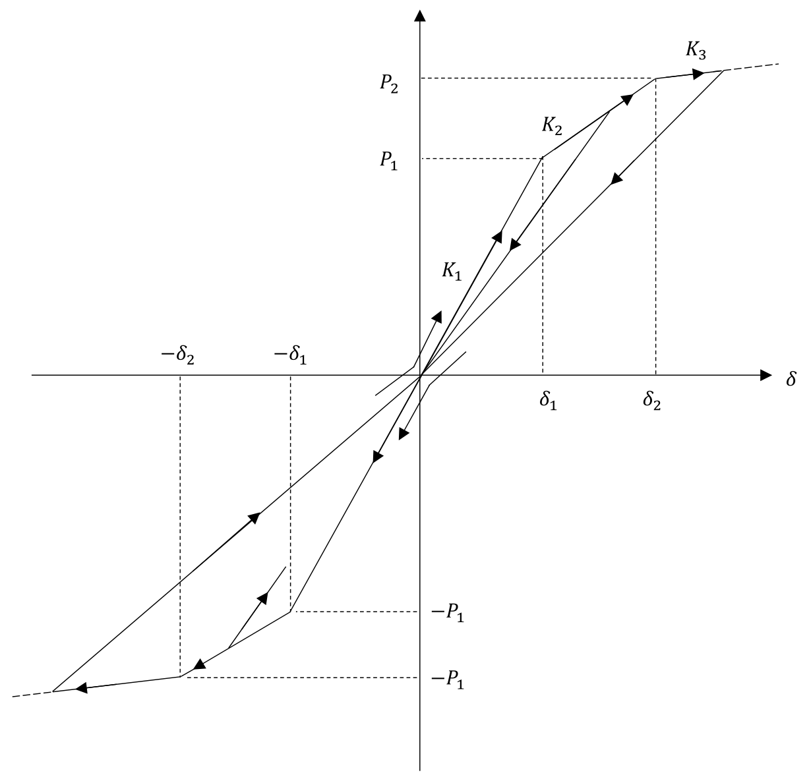

---

## 7.10. トリリニア（逆行型）

骨格曲線は下図のようになり、履歴曲線は描かずに骨格曲線上を動きます。

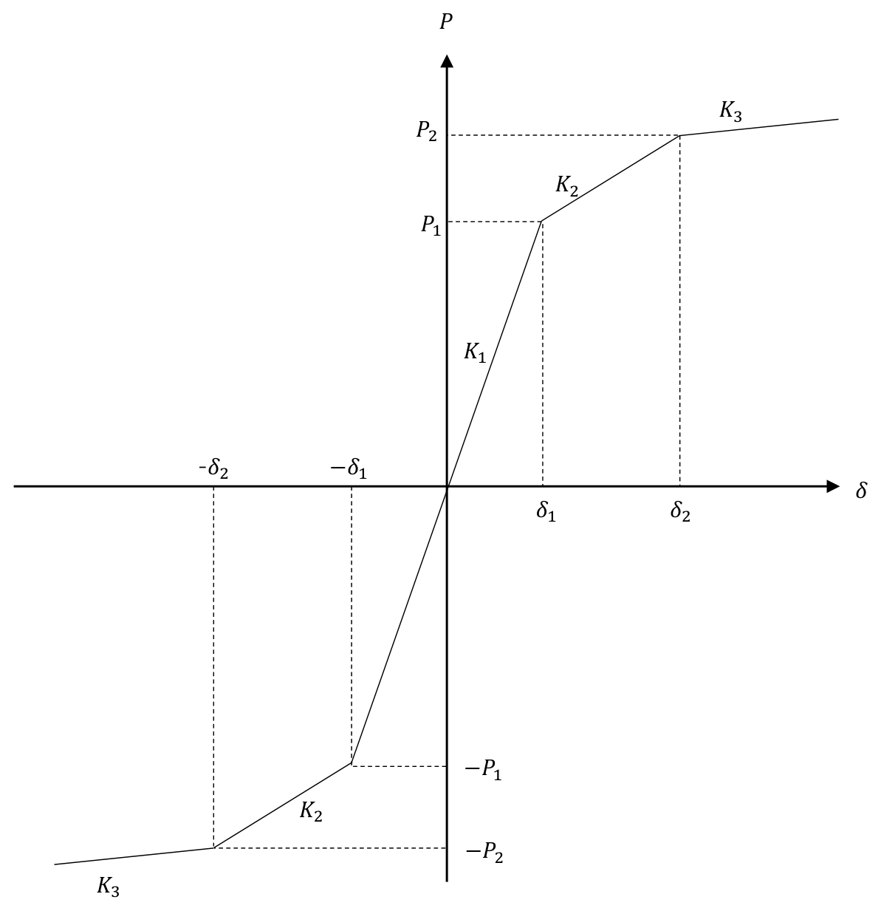

**骨格曲線パラメータ：**
- $\delta_1$：第1折れ点変位
- $\delta_2$：第2折れ点変位
- $F_1$：第1折れ点荷重
- $F_2$：第2折れ点荷重
- $K_1$：初期剛性
- $K_2$：第2勾配
- $K_3$：第3勾配
- $-\delta_1$, $-\delta_2$：負側折れ点変位
- $-F_1$, $-F_2$：負側折れ点荷重

---

## 7.11. JR総研剛性低減RC型

骨格曲線はテトラリニア型です。

> FrameWeb3実装（2026-09-08、第3段階）: 原文の規則と、実装に必要な補完仕様を
> [修正プラン](../plans/material-nonlinear-tdd.md)で区別して定義し、
> [検証記録](../report/material-nonlinear-tdd.md)に手計算とRed→Greenを記載した。
> K4=0、K_minの適用、非対称時の側の選択、ゼロ前の再反転、入れ子の戻り枝、
> ゼロ力点が目標を追い越す場合の接続は同プラン参照。以下の原文の式は変更しない。

**履歴ルール：**

### (1) $|\delta_{max}| < \delta_1$ の場合
原点を通る勾配 $K_1$ の直線上を動きます。

### (2) $\delta$ が $\delta_1$ を超えた場合
骨格曲線上の第2勾配 $K_2$ の直線上を進みます。

この直線から戻って反対方向に進む場合は、戻り点から次式で求まる勾配 $K_d$ の直線上を進みます。戻り点が新しい $\delta_{max}$ および $F_{max}$ となります。

$$K_d = K_1 \left| \frac{\delta_{max}}{\delta_1} \right|^{-\beta} \quad \left( \frac{F_{max} - F_1}{\delta_{max} - \delta_1} < K_d < K_1 \right)$$

(7.11.1)

復元力0の点を超えると、最大変形点を目指します。反対側の最大変形点が弾性域の場合は、反対側の第1折れ点を目指します。

第1折れ点、または最大変形点を目指す直線上から戻る場合は、上式で求まる勾配 $K_d$ 上を進み、復元力0を超えると反対側の最大変形点を目指します。この時の $\delta$ が内部ループの最大変形 $\delta_{max,i}$ となります。

最大変形点を目指す直線上から戻る場合は、上式で求まる勾配 $K_d$ 上を進み、復元力0を超えると反対側の $\delta_{max,i}$ を目指します。この時の $\delta$ が内部ループの最大変形点 $\delta_{max,i}$ となります。$\delta_{max,i}$ を超えると、反対側の最大変形点を目指します。

最大変形点を超えた場合は、骨格曲線上の第2勾配 $K_2$ の直線上を進みます。

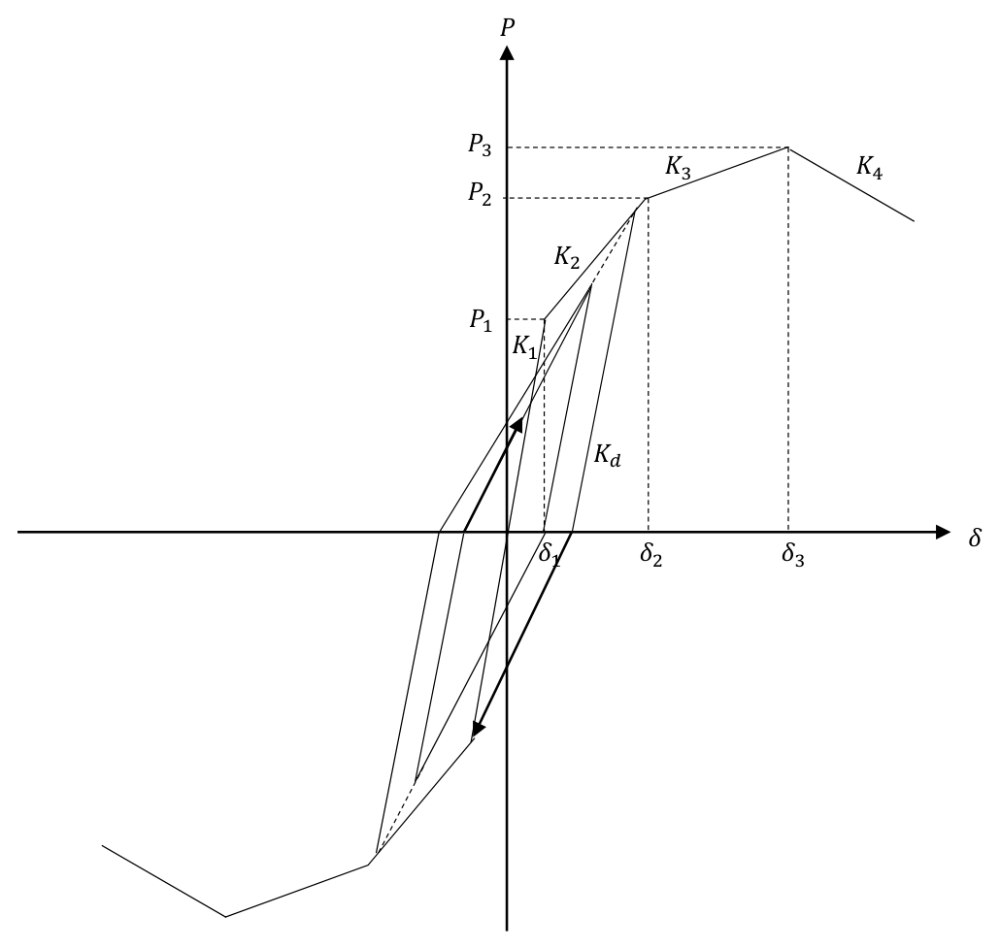

### (3) $\delta$ が $\delta_2$ を超えた場合
骨格曲線上の第3勾配 $K_3$ の直線上を進みます。

この直線から戻って反対方向に進む場合は、戻り点から次式で求まる勾配 $K_d$ の直線上を進みます。戻り点の $\delta$ が新しい $\delta_{max}$ になります。

$$K_d = \frac{F_2 - F_1}{\delta_2 - \delta_1} \left| \frac{\delta_{max}}{\delta_2} \right|^{-\beta}$$

(7.11.2)

復元力0の点を超えると、最大変形点を目指します。反対側の最大変形が弾性域、またはひび割れ域の場合は、反対側の第2折れ点を目指します。

第2折れ点、または最大変形点を目指す直線上から戻る場合は、上式で求まる勾配 $K_d$ 上を進み、復元力0を超えると反対側の最大変形点を目指します。この時の戻り点が内部ループの最大変形 $\delta_{max,i}$ となります。

最大変形点を目指す直線上から戻る場合は、上式で求まる勾配 $K_d$ 上を進み、復元力0を超えると反対側の最大 $\delta_{max,i}$ を目指します。$\delta_{max,i}$ を超えると反対側の最大変形点を目指します。

最大変形点を超えた場合は、骨格曲線上の第3勾配 $K_3$ の直線上を進みます。

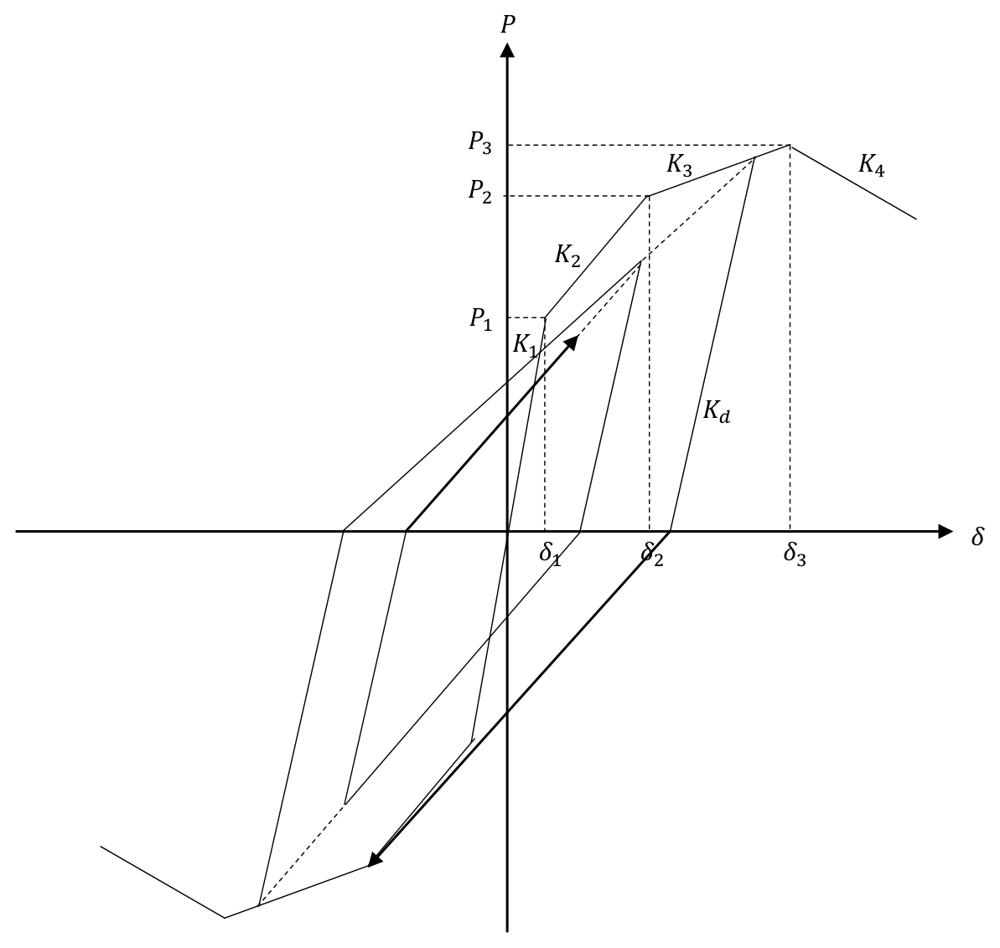

### (4) $\delta$ が $\delta_3$ を超えた場合
骨格曲線上の第4勾配 $K_4$ の直線上を進みます。

この直線から戻って反対方向に進む場合は、戻り点から次式で求まる勾配 $K_d$ の直線上を進みます。戻り点の $\delta$ が新しい $\delta_{max}$ になります。

$$K_d = \frac{F_2 - F_1}{\delta_2 - \delta_1} \left| \frac{\delta_{max}}{\delta_2} \right|^{-\beta}$$

(7.11.3)

復元力0の点を超えると、最大変形点を目指します。反対側の最大変形が弾性域、またはひび割れ域の場合は、反対側の第2折れ点を目指します。

第2折れ点、または最大変形点を目指す直線上から戻る場合は、上式で求まる勾配 $K_d$ 上を進み、復元力0を超えると反対側の最大変形点を目指します。この時の戻り点が内部ループの最大変形 $\delta_{max,i}$ となります。

最大変形点を目指す直線上から戻る場合は、上式で求まる勾配 $K_d$ 上を進み、復元力0を超えると反対側の最大 $\delta_{max,i}$ を目指します。$\delta_{max,i}$ を超えると反対側の最大変形点を目指します。

最大変形点を超えた場合は、骨格曲線上の第4勾配 $K_4$ の直線上を進みます。

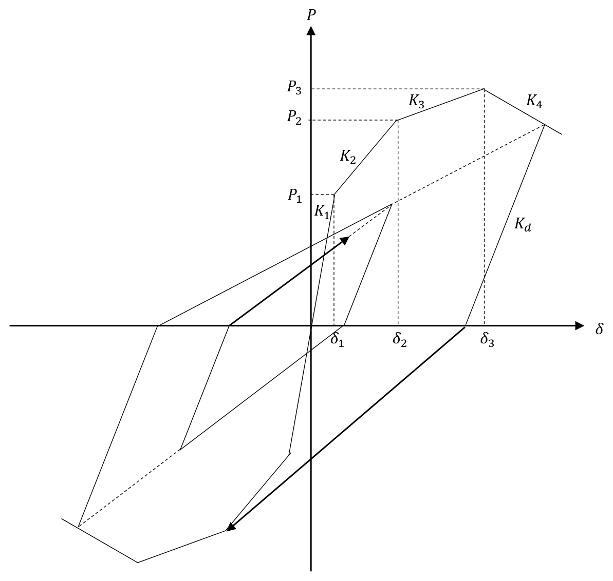

---

## 7.12. ペンタリニア（JR内巻きスパイラル型）

骨格曲線はペンタリニアです。

**履歴ルール：**

### (1) $|\delta_{max}| < \delta_1$ の場合
原点を通る勾配 $K_1$ の直線上を動きます。

### (2) $\delta$ が $\delta_1$ を超えた場合
骨格曲線上の第2勾配 $K_2$ の直線上を進みます。

この直線から戻って反対方向に進む場合は、戻り点から次式で求まる勾配 $K_d$ の直線上を進みます。戻り点が新しい $\delta_{max}$ および $F_{max}$ となります。

$$K_d = K_1 \left| \frac{\delta_{max}}{\delta_1} \right|^{-\alpha} \quad \left( \frac{F_{max} - F_1}{\delta_{max} - \delta_1} < K_d < K_1 \right)$$

(7.12.1)

復元力0の点を超えると、最大変形点を目指します。反対側の最大変形点が弾性域の場合は、反対側の第1折れ点を目指します。

第1折れ点、または最大変形点を目指す直線上から戻る場合は、上式で求まる勾配 $K_d$ 上を進み、復元力0を超えると反対側の最大変形点を目指します。この時の $\delta$ が内部ループの最大変形 $\delta_{max,i}$ となります。

最大変形点を目指す直線上から戻る場合は、上式で求まる勾配 $K_d$ 上を進み、復元力0を超えると反対側の $\delta_{max,i}$ を目指します。この時の $\delta$ が内部ループの最大変形点 $\delta_{max,i}$ となります。$\delta_{max,i}$ を超えると、反対側の最大変形点を目指します。

最大変形点を超えた場合は、骨格曲線上の第2勾配 $K_2$ の直線上を進みます。

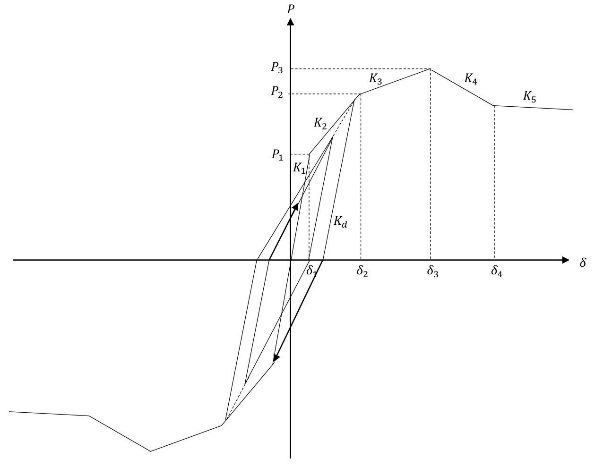

### (3) $\delta$ が $\delta_2$ を超えた場合
骨格曲線上の第3勾配 $K_3$ の直線上を進みます。

この直線から戻って反対方向に進む場合は、戻り点から次式で求まる勾配 $K_d$ の直線上を進みます。戻り点の $\delta$ が新しい $\delta_{max}$ になります。

$$K_d = \frac{F_2 - F_1}{\delta_2 - \delta_1} \left| \frac{\delta_{max}}{\delta_2} \right|^{-\alpha}$$

(7.12.2)

復元力0の点を超えると、最大変形点を目指します。反対側の最大変形が弾性域、またはひび割れ域の場合は、反対側の第2折れ点を目指します。

第2折れ点、または最大変形点を目指す直線上から戻る場合は、上式で求まる勾配 $K_d$ 上を進み、復元力0を超えると反対側の最大変形点を目指します。この時の戻り点が内部ループの最大変形 $\delta_{max,i}$ となります。

最大変形点を目指す直線上から戻る場合は、上式で求まる勾配 $K_d$ 上を進み、復元力0を超えると反対側の最大 $\delta_{max,i}$ を目指します。$\delta_{max,i}$ を超えると反対側の最大変形点を目指します。

最大変形点を超えた場合は、骨格曲線上の第3勾配 $K_3$ の直線上を進みます。

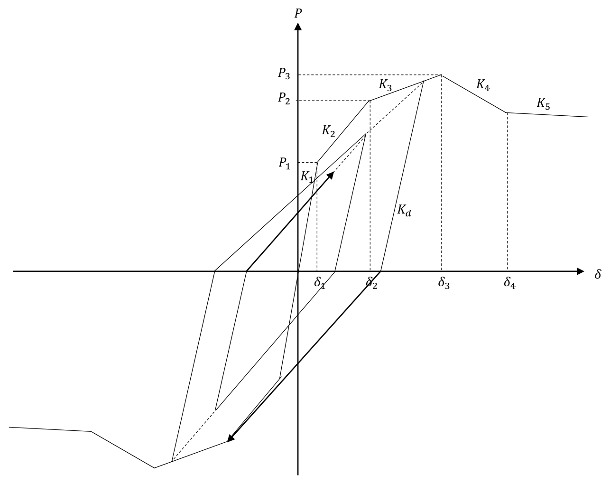

### (4) $\delta$ が $\delta_3$ を超えた場合
骨格曲線上の第4勾配 $K_4$ の直線上を進みます。

この直線から戻って反対方向に進む場合は、戻り点から次式で求まる勾配 $K_d$ の直線上を進みます。戻り点の $\delta$ が新しい $\delta_{max}$ になります。

$$K_d = \frac{F_2 - F_1}{\delta_2 - \delta_1} \left| \frac{\delta_{max}}{\delta_2} \right|^{-\alpha}$$

(7.12.3)

復元力0の点を超えると、最大変形点を目指します。反対側の最大変形が弾性域、またはひび割れ域の場合は、反対側の第2折れ点を目指します。

第2折れ点、または最大変形点を目指す直線上から戻る場合は、上式で求まる勾配 $K_d$ 上を進み、復元力0を超えると反対側の最大変形点を目指します。この時の戻り点が内部ループの最大変形 $\delta_{max,i}$ となります。

最大変形点を目指す直線上から戻る場合は、上式で求まる勾配 $K_d$ 上を進み、復元力0を超えると反対側の最大 $\delta_{max,i}$ を目指します。$\delta_{max,i}$ を超えると反対側の最大変形点を目指します。

最大変形点を超えた場合は、骨格曲線上の第4勾配 $K_4$ の直線上を進みます。

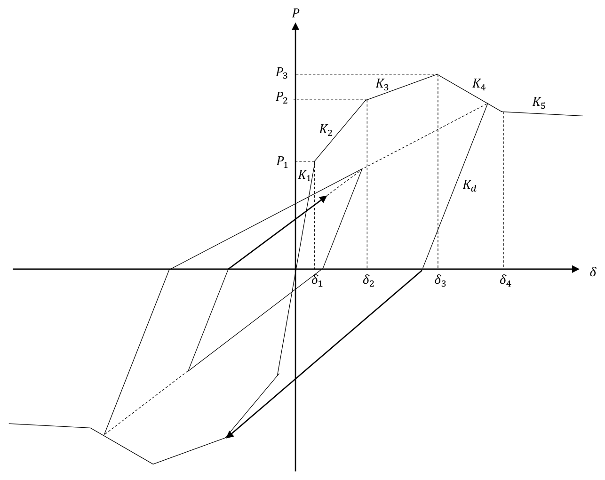

### (5) $\delta$ が $\delta_4$ を超えた場合
骨格曲線上の第5勾配 $K_5$ の直線上を進みます。

この直線から戻って反対方向に進む場合は、戻り点から次式で求まる勾配 $K_d$ の直線上を進みます。戻り点の $\delta$ が新しい $\delta_{max}$ になります。

$$K_d = \frac{F_2 - F_1}{\delta_2 - \delta_1} \left| \frac{\delta_{max}}{\delta_2} \right|^{-\alpha}$$

(7.12.4)

復元力0の点を超えると、最大変形点を目指します。反対側の最大変形が弾性域、またはひび割れ域の場合は、反対側の第2折れ点を目指します。反対側の最大変形がL点を超えている場合は次式で求まる勾配 $K_s$ の直線上を進み、立ち上がり開始点を目指します。

$$K_s = \frac{F_{max}}{\delta_{max} - \delta_0} \left| \frac{\delta_{max}}{\delta_{max} - \delta_0} \right|^{-\beta}$$

(7.12.5)

立ち上がり開始点を目指す直線上から戻る場合は、上式で求まる勾配 $K_d$ 上を進み、復元力0を超えると反対側の立ち上がり開始点を目指します。この時の戻り点が内部ループの最大変形 $\delta_{max,i}$ となります。

立ち上がり開始点を目指す直線上から戻る場合は、上式で求まる勾配 $K_d$ 上を進み、復元力0を超えると反対側の最大 $\delta_{max,i}$ を目指します。$\delta_{max,i}$ を超えると反対側の立ち上がり開始点を目指します。

立ち上がり開始点を超えた場合は、次式で求まる勾配 $K_p$ の直線上を進み、骨格曲線を目指します。

$$K_p = \gamma \frac{F_{max}}{\delta_{max}} \quad \left( K_p < \frac{F_{max} - F_s}{\delta_{max} - \delta_s} \right)$$

(7.12.6)

骨格曲線を目指す直線上から戻る場合は、勾配 $K_d$ 上を進み、復元力0を超えると上式で求まる勾配 $K_s$ の直線上を進み、反対側の立ち上がり開始点を目指します。この時の戻り点が内部ループの最大変形 $\delta_{max,i}$ となります。

立ち上がり剛性 $K_p$ で進み、骨格曲線に到達したら、骨格曲線上の第5勾配 $K_5$ の直線上を進みます。

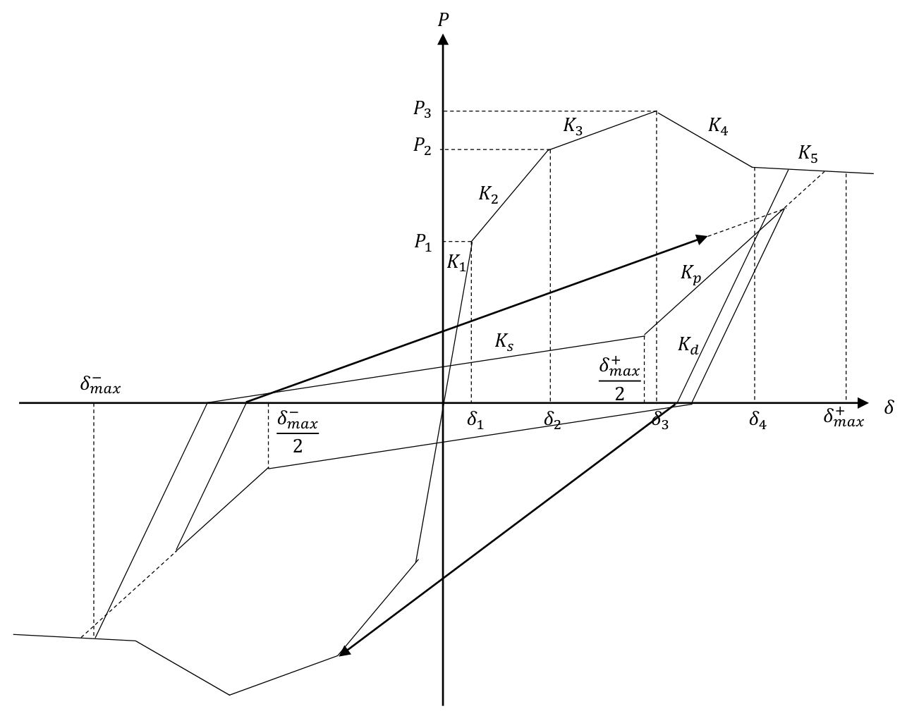

**参考文献：**
1. 井口重信，山田章史，中村瑞穂，築嶋大輔：軸方向鉄筋の内側に円形帯鉄筋を配置した鉄筋コンクリート柱部材における履歴モデルに関する一考察，コンクリート工学年次論文集，Vol. 36，No. 2，2014.

---

## 7.13. 履歴関数型・双曲線

骨格曲線は以下の関数で示されます。

$$F = \frac{K_0 \cdot \delta}{1 + \left| \frac{\delta}{\delta_r} \right|}$$

(7.13.1)

履歴ルールはMasingの規則に従い、以下の関数で示されます。

$$\frac{F - F_a}{2} = f\left( \frac{\delta - \delta_a}{2} \right)$$

(7.13.2)

$$F - F_a = \frac{K_0 \cdot (\delta - \delta_a)}{1 + \left| \frac{\delta - \delta_a}{2\delta_r} \right|}$$

(7.13.3)

ここで、
- $K_0$：初期剛性
- $\delta_r$：規準変位

**履歴ルール：**

1. $\delta$ が折り返すまでは、式(7.13.1)で示す骨格曲線上を進みます。

2. $\delta$ が折り返し始めると、折り返し点を $(\delta_a, F_a)$ とした式(7.13.2)で示す履歴曲線上を進みます。

3. $\delta$ が再度折り返すと折り返し点を $(\delta_b, F_b)$ とした式(7.13.2)で示す履歴曲線上を進みます。

4. 履歴曲線が初期の折り返し点 $(\delta_a, F_a)$ に達すると、それ以降は骨格曲線上を進みます。

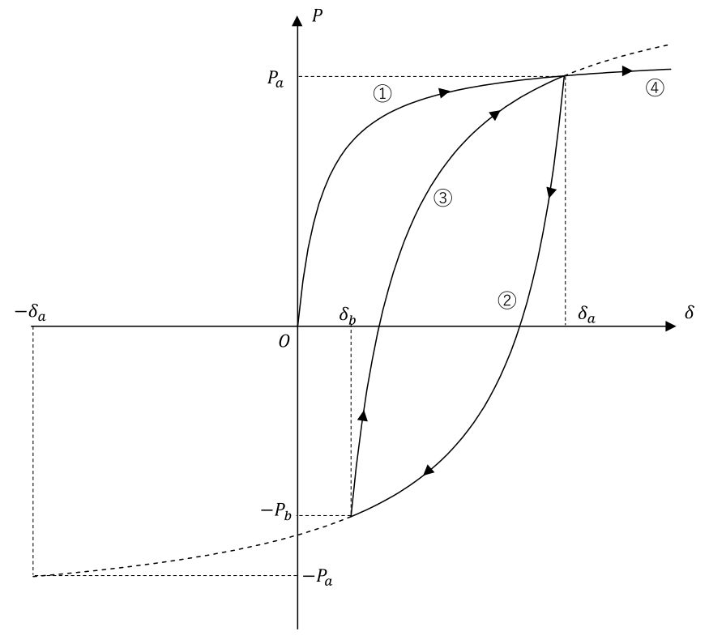

**参考文献：**
1. Konder R.L：Hyperbolic Stress-Strain Response; Cohesive Soils, Proc. ASCE, SM1, pp.115-143, 1963.

---

## 7.14. 履歴関数型・RO（Ramberg-Osgood モデル）

骨格曲線は以下の関数で示されます。

$$\delta = \frac{F}{K_0} \left\{ 1 + \alpha \left| \frac{F}{F_y} \right|^{\beta - 1} \right\}$$

(7.14.1)

履歴ルールはMasingの規則に従い、以下の関数で示されます。

$$\delta - \delta_a = \frac{F - F_a}{K_0} \left\{ 1 + \alpha \left| \frac{F - F_a}{2F_y} \right|^{\beta - 1} \right\}$$

(7.14.2)

ここで、
- $K_0$：初期剛性
- $\alpha$, $\beta$, $F_y$：ROモデルのパラメータ（$F_y = K_0 \cdot \delta_r$）
- $\delta_r$：規準変位
- $\alpha = 2^{\beta - 1}$
- $\beta = \frac{2\pi h_{max}}{2 - \pi h_{max}}$（$h_{max}$：最大減衰定数）

**履歴ルール：**

1. $\delta$ が折り返すまでは、式(7.14.1)で示す骨格曲線上を進みます。

2. $\delta$ が折り返し始めると、折り返し点を $(\delta_a, F_a)$ とした式(7.14.2)で示す履歴曲線上を進みます。

3. $\delta$ が再度折り返すと折り返し点を $(\delta_b, F_b)$ とした式(7.14.2)で示す履歴曲線上を進みます。

4. 履歴曲線が初期の折り返し点 $(\delta_a, F_a)$ に達すると、それ以降は骨格曲線上を進みます。

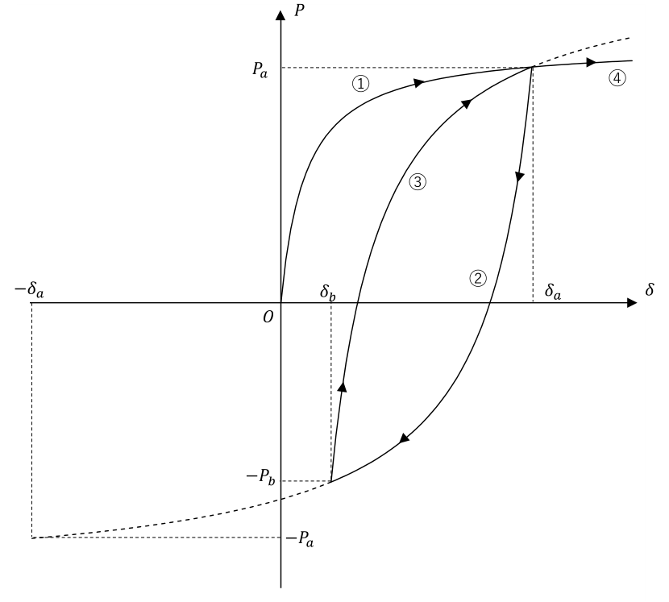

**参考文献：**
1. Jennings P.C：Periodic Response of a General Yielding Structure, Proc. ASCE, EM2, pp.131-163, 1964.

---

## 7.15. 履歴関数型・修正GHEモデル

骨格曲線は以下の関数で示されます。

$$F = \frac{K_0 \cdot \delta}{\frac{1}{C_1(\delta)} + \frac{1}{C_2(\delta)} \left| \frac{\delta}{\delta_r} \right|}$$

(7.15.1)

ここで、
- $K_0$：初期剛性
- $\delta_r$：規準変位

また、$C_1(\delta)$ および $C_2(\delta)$ は骨格曲線の補正係数であり、以下の式で表されます。

$$C_1(\delta) = \frac{C_1(0) + C_1(\infty)}{2} + \frac{C_1(0) - C_1(\infty)}{2} \cdot \cos\left\{ \frac{\pi}{\alpha \left| \delta / \delta_r \right| + 1} \right\}$$

(7.15.2)

$$C_2(\delta) = \frac{C_2(0) + C_2(\infty)}{2} + \frac{C_2(0) - C_2(\infty)}{2} \cdot \cos\left\{ \frac{\pi}{\beta \left| \delta / \delta_r \right| + 1} \right\}$$

(7.15.3)

ここで、$C_1(0)$, $C_1(\infty)$, $C_2(0)$, $C_2(\infty)$, $\alpha$, $\beta$：修正GHEモデルのパラメータ

履歴曲線は以下の関数で示されます。

$$F - F_a = K_0(\delta_a') \cdot \frac{\delta - \delta_a}{\frac{1}{C_1(\delta)} + \frac{1}{C_2(\delta)} \left| \frac{\delta - \delta_a}{2\delta_r'} \right|}$$

(7.15.4)

ここで、
- $\delta_a$：骨格曲線上または履歴曲線上から除荷（再載荷）された時の変位
- $F_a$：骨格曲線上または履歴曲線上から除荷（再載荷）された時の力
- $\delta_a'$：骨格曲線上から除荷または再載荷された時の変位

また、$C_1(\delta)$ および $C_2(\delta)$ は履歴曲線の補正係数であり、以下の式で表されます。

$$C_1(\delta) = \frac{C_1(0) + C_1(\infty)}{2} + \frac{C_1(0) - C_1(\infty)}{2} \cdot \cos\left\{ \frac{\pi}{\alpha \left| (\delta - \delta_a) / 2\delta_r' \right| + 1} \right\}$$

(7.15.5)

$$C_2(\delta) = \frac{C_2(0) + C_2(\infty)}{2} + \frac{C_2(0) - C_2(\infty)}{2} \cdot \cos\left\{ \frac{\pi}{\beta \left| (\delta - \delta_a) / 2\delta_r' \right| + 1} \right\}$$

(7.15.6)

ここで、$K_0(\delta_a')$ は除荷時の接線剛性を示します。なお、数値計算上では、骨格曲線から折り返した時の履歴ループの面積から求まる履歴減衰定数 $h$ と、土の繰返し載荷試験の $h$〜$\gamma$ 関係から得られる減衰定数 $h_a$ が一致するように $K_0(\delta_a')$ を決定します。

（※本プログラムでは、ばね要素で履歴曲線を定義するため、$h$〜$\delta$ 関係となります）

また、$h$〜$\delta$ 関係から得られる減衰定数 $h_a$ は以下の式より算出します。

$$h_a = h_{max} \cdot \left( 1 - \frac{K}{K_0} \right)^\kappa$$

(7.15.7)

$$\frac{K}{K_0} = \frac{1}{\frac{1}{C_1(\delta_a')} + \frac{1}{C_2(\delta_a')} \left| \frac{\delta_a'}{\delta_r} \right|}$$

(7.15.8)

式(7.15.8)の補正係数 $C_1(\delta_a')$ および $C_2(\delta_a')$ は以下の式より算出します。

$$C_1(\delta_a') = \frac{C_1(0) + C_1(\infty)}{2} + \frac{C_1(0) - C_1(\infty)}{2} \cdot \cos\left\{ \frac{\pi}{\alpha \left| \delta_a' / \delta_r \right| + 1} \right\}$$

(7.15.9)

$$C_2(\delta_a') = \frac{C_2(0) + C_2(\infty)}{2} + \frac{C_2(0) - C_2(\infty)}{2} \cdot \cos\left\{ \frac{\pi}{\beta \left| \delta_a' / \delta_r \right| + 1} \right\}$$

(7.15.10)

骨格曲線上からの除荷点または再載荷点（$\delta_a'$, $F_a'$）では、除荷時の接線剛性 $K_0(\delta_a')$ を適用するため、それに伴い規準変位も修正する必要があります。（$\delta_r$ から $\delta_r'$ に修正）

修正した規準変位 $\delta_r'$ は、次の関係式から算出します。

$$F_a' = \frac{K_0(\delta_a') \cdot \delta_a'}{\frac{1}{C_1(\delta)} + \frac{1}{C_2(\delta)} \left| \frac{\delta_a'}{\delta_r'} \right|}$$

(7.15.11)

なお、再度、骨格曲線上で除荷または載荷が起こる場合のみ、$K_0(\delta_a')$ および $\delta_r'$ の更新を行います。

ここで、$K_0(\delta_a')$ を用いて改良したMasing則による履歴曲線は、$K_0(\delta_a') = K_0$ の場合に限り、通常のMasing則と同様の履歴曲線を描きます。

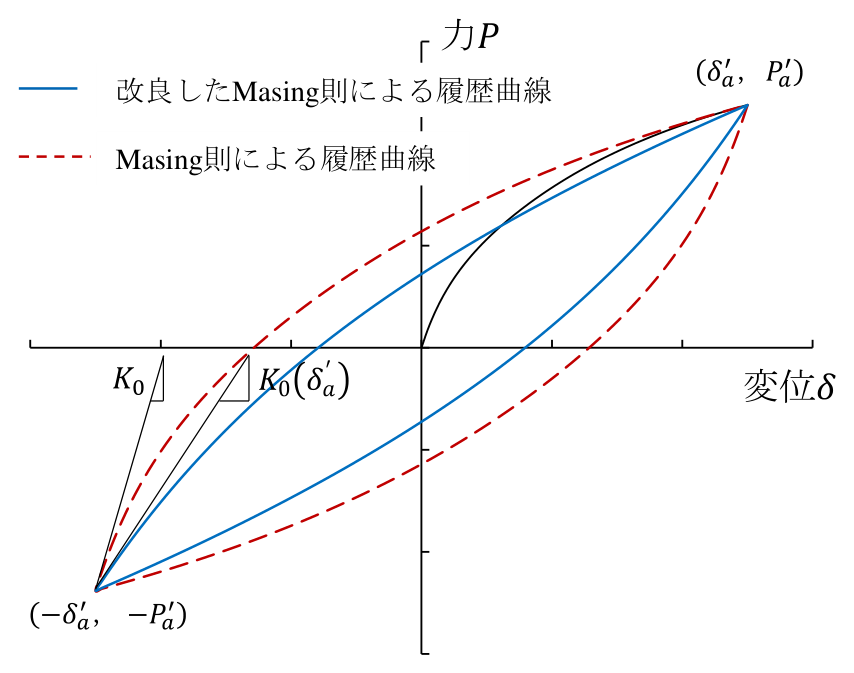

**履歴ルール：**

1. $\delta$ が折り返すまでは、式(7.15.1)で示す骨格曲線上を進みます。（O→A）

2. $\delta$ が点Aで除荷されると、折り返し点を $(\delta_a, F_a)$ とした式(7.15.4)で示す履歴曲線上を進みます。（A→B→C）

3. $\delta$ が点Cで再載荷されると、折り返し点を $(\delta_c, -F_c)$ とした式(7.15.4)で示す履歴曲線上を進みます。（C→D→A）

4. 履歴曲線が初期の折り返し点 $(\delta_a, F_a)$ に達すると、除荷以前に進行していた骨格曲線上を進みます。（A→E）

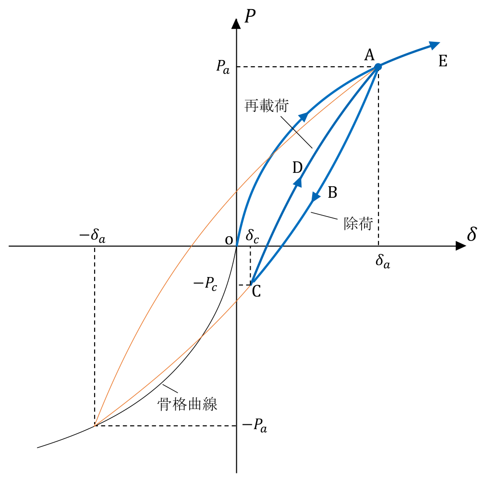

**参考文献：**
1. Tatsuoka F. and Shibuya S.：Deformation characteristics of soils and rocks form field and laboratory tests, Theme Lecture 1, Proc. of Ninth Asian Regional Conference on Soil Mechanics and Foundation Engineering, Vol.2, pp.101-170, 1992.
2. 西村昭彦，室野剛隆：GHEモデルと簡易な履歴則を用いた土の非線形モデルの提案と実験的検証，第25回地震工学研究発表会講演論文集，pp.309-312，1999.

---

## 7.16. 履歴関数型・GHE-Sモデル

骨格曲線は以下の関数で示されます。

$$F = \frac{K_0 \cdot \delta}{\frac{1}{C_1(\delta)} + \frac{1}{C_2(\delta)} \left| \frac{\delta}{\delta_r} \right|}$$

(7.16.1)

ここで、
- $K_0$：初期剛性
- $\delta_r$：規準変位

また、$C_1(\delta)$ および $C_2(\delta)$ は骨格曲線の補正係数であり、以下の式で表されます。

$$C_1(\delta) = \frac{C_1(0) + C_1(\infty)}{2} + \frac{C_1(0) - C_1(\infty)}{2} \cdot \cos\left\{ \frac{\pi}{\alpha \left| \delta / \delta_r \right| + 1} \right\}$$

(7.16.2)

$$C_2(\delta) = \frac{C_2(0) + C_2(\infty)}{2} + \frac{C_2(0) - C_2(\infty)}{2} \cdot \cos\left\{ \frac{\pi}{\beta \left| \delta / \delta_r \right| + 1} \right\}$$

(7.16.3)

ここで、$C_1(0)$, $C_1(\infty)$, $C_2(0)$, $C_2(\infty)$, $\alpha$, $\beta$：GHE-Sモデルのパラメータ

履歴曲線は以下の関数で示されます。

$$F - F_a = K_r \cdot \frac{\delta - \delta_a}{\frac{1}{C_1(\delta)} + \frac{1}{C_2(\delta)} \left| \frac{\delta - \delta_a}{\lambda(\delta) \cdot \delta_r'} \right|}$$

(7.16.4)

ここで、
- $\delta_a$：骨格曲線上または履歴曲線上から除荷（再載荷）された時の変位
- $F_a$：骨格曲線上または履歴曲線上から除荷（再載荷）された時の力

また、$C_1(\delta)$ および $C_2(\delta)$ は履歴曲線の補正係数であり、以下の式で表されます。

$$C_1(\delta) = \frac{C_1(0) + C_1(\infty)}{2} + \frac{C_1(0) - C_1(\infty)}{2} \cdot \cos\left\{ \frac{\pi}{\alpha \left| (\delta - \delta_a) / (\lambda(\delta) \cdot \delta_r') \right| + 1} \right\}$$

(7.16.5)

$$C_2(\delta) = \frac{C_2(0) + C_2(\infty)}{2} + \frac{C_2(0) - C_2(\infty)}{2} \cdot \cos\left\{ \frac{\pi}{\beta \left| (\delta - \delta_a) / (\lambda(\delta) \cdot \delta_r') \right| + 1} \right\}$$

(7.16.6)

$K_r$ は除荷時の接線剛性であり、以下の吉田らの提案式を適用します。

$$K_r = K_0 \cdot \left( \frac{1 - K_{min}/K_{max}}{1 + \left| \delta_a' / \delta_{r0} \right|} + \frac{K_{min}}{K_{max}} \right)$$

(7.16.7)

ここで、
- $\delta_a'$：骨格曲線上から除荷または再載荷された時の変位
- $\delta_{r0}$：除荷時の接線剛性用の規準変位

なお、提案式の各種パラメータは、材料ごとに下表の値が示されています。

| 材料 | $\gamma_{r0}$ | $K_{min}/K_{max}$ |
|------|---------------|-------------------|
| 砂（Dr=50%） | 0.0006 | 0.18 |
| 砂（Dr=80%） | 0.0015 | 0.35 |
| 粘土 | 0.013 | 0.1 |

骨格曲線上からの除荷点または再載荷点（$\delta_a'$, $F_a'$）では、除荷時の接線剛性 $K_r$ を適用するため、それに伴い規準変位も修正する必要があります。（$\delta_r$ から $\delta_r'$ に修正）

修正した規準変位 $\delta_r'$ は、次の関係式から算出します。

$$F_a' = \frac{K_r \cdot \delta_a'}{\frac{1}{C_1(\delta)} + \frac{1}{C_2(\delta)} \left| \frac{\delta_a'}{\delta_r'} \right|}$$

(7.16.8)

なお、履歴曲線上で除荷または載荷が起こる場合は、$K_r$ および $\delta_r'$ の更新は行いません。

式(7.16.4)の履歴曲線の相似関数 $\lambda(\delta)$ は、以下の式で示されます。

$$\lambda(\delta) = \left( 2 - \frac{\lambda_{min}}{\delta_a'^2} \right) \cdot \delta^2 + \lambda_{min}$$

(7.16.9)

ここで、$\lambda_{min}$ は相似比を意味し、$1 \leq \lambda_{min} \leq 2$ の値を取ります。なお、数値計算上では、骨格曲線から折り返した時の履歴ループの面積から求まる履歴減衰定数 $h$ と、土の繰返し載荷試験の $h$〜$\gamma$ 関係から得られる減衰定数 $h_a$ が一致するように $\lambda_{min}$ を決定します。

（※本プログラムでは、ばね要素で履歴曲線を定義するため、$h$〜$\delta$ 関係となります）

また、$h$〜$\delta$ 関係から得られる減衰定数 $h_a$ は以下の式より算出します。

$$h_a = h_{max} \cdot \left( 1 - \frac{K}{K_0} \right)^\kappa$$

(7.16.10)

$$\frac{K}{K_0} = \frac{1}{\frac{1}{C_1(\delta_a')} + \frac{1}{C_2(\delta_a')} \left| \frac{\delta_a'}{\delta_r} \right|}$$

(7.16.11)

ここで、$h_{max}$, $\kappa$：式(7.16.10)で用いるパラメータ

式(7.16.11)の補正係数 $C_1(\delta_a')$ および $C_2(\delta_a')$ は以下の式より算出します。

$$C_1(\delta_a') = \frac{C_1(0) + C_1(\infty)}{2} + \frac{C_1(0) - C_1(\infty)}{2} \cdot \cos\left\{ \frac{\pi}{\alpha \left| \delta_a' / \delta_r \right| + 1} \right\}$$

(7.16.12)

$$C_2(\delta_a') = \frac{C_2(0) + C_2(\infty)}{2} + \frac{C_2(0) - C_2(\infty)}{2} \cdot \cos\left\{ \frac{\pi}{\beta \left| \delta_a' / \delta_r \right| + 1} \right\}$$

(7.16.13)

ここで、各相似比 $\lambda_{min}$ における履歴曲線について：

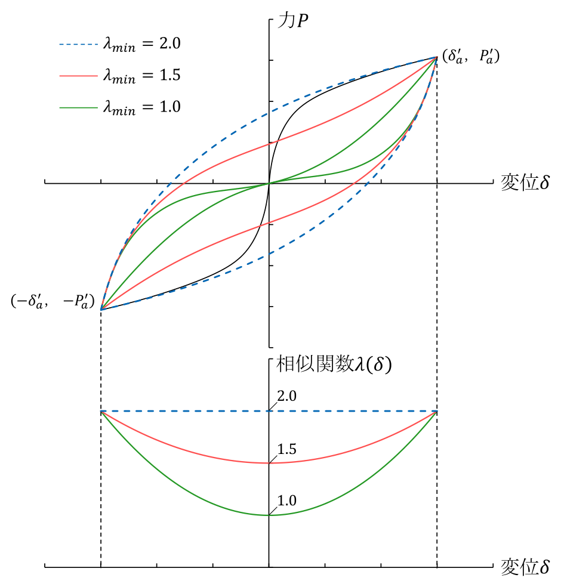

$\lambda_{min} = 2.0$ の場合、相似関数 $\lambda(\delta)$ は常に2のため、通常のMasing則と同様に紡錘型の履歴曲線となります。$\lambda_{min}$ が2より小さい場合、履歴曲線はS字型のループを描く形になります。なお、$\lambda_{min}$ が1.0未満の場合、履歴曲線が原点付近で交差する形状になります。そのため、本プログラムでの $\lambda_{min}$ の下限値は1.0とします。

**履歴ルール：**

1. $\delta$ が折り返すまでは、式(7.16.1)で示す骨格曲線上を進みます。（O→A）

2. $\delta$ が点Aで除荷されると、折り返し点を $(\delta_a, F_a)$ とした式(7.16.4)で示す履歴曲線上を進みます。（A→B→C）

3. $\delta$ が点Cで再載荷されると、折り返し点を $(\delta_c, -F_c)$ とした式(7.16.4)で示す履歴曲線上を進みます。（C→D）

4. 点Dで(3)の履歴曲線が(2)の履歴曲線に到達すると、点Aに到達するまで(2)の履歴曲線上を進みます。（D→E→A）

5. 履歴曲線が初期の折り返し点 $(\delta_a, F_a)$ に達すると、除荷以前に進行していた骨格曲線上を進みます。（A→F）

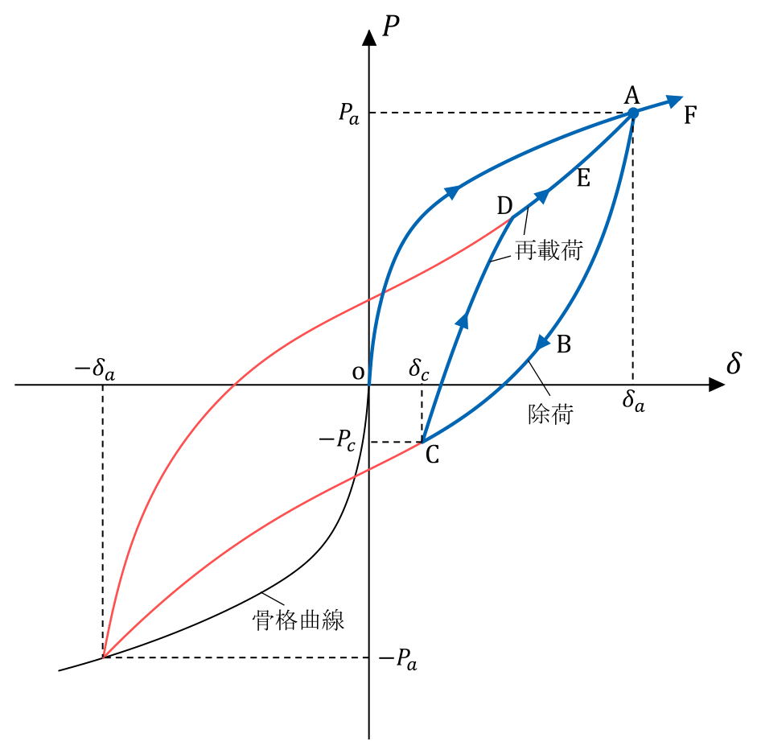

**参考文献：**
1. Tatsuoka F. and Shibuya S.：Deformation characteristics of soils and rocks form field and laboratory tests, Theme Lecture 1, Proc. of Ninth Asian Regional Conference on Soil Mechanics and Foundation Engineering, Vol.2, pp.101-170, 1992.
2. 室野剛隆，野上雄太：S字型の履歴曲線の形状を考慮した土の応力〜ひずみ関係，第12回日本地震工学シンポジウム，pp.494-497，2006.
3. 吉田望，澤田純男，竹島康人，三上武子，澤田俊一：履歴減衰特性が地盤の地震応答に与える影響，土木学会地震工学論文集，Vol.27，2003.

---

## 7.17. 衝突ばね

骨格曲線はバイリニアとします。

**履歴ルール：**

1. $\delta_1^- < \delta < \delta_1^+$ の場合、原点を通る勾配 $K_1$ の直線上を動きます。$K_1 = 0$ の場合は $\delta$ 軸上を動きます。

2. $\delta > \delta_1^+$ の場合、勾配 $K_2$ の直線上を動きます。

3. $\delta < \delta_1^-$ の場合、勾配 $K_3$ の直線上を動きます。

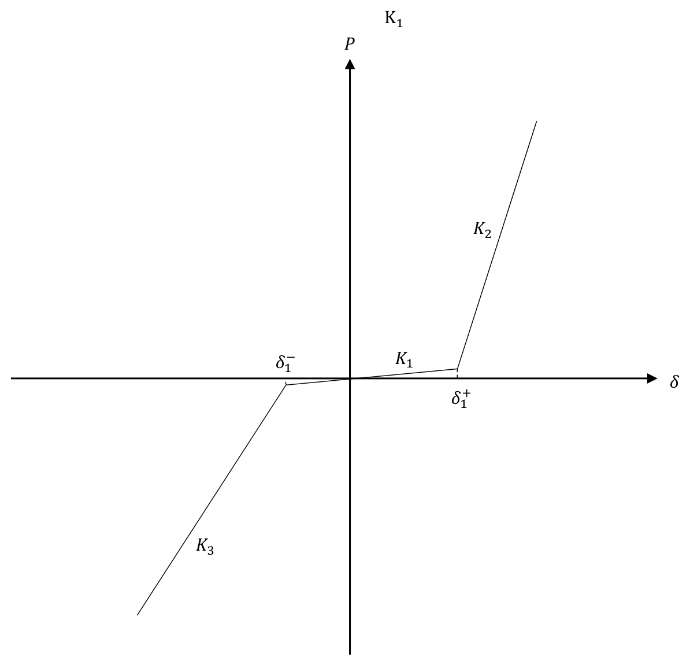

---

## 7.18. ヒューズばね

ヒューズばねの履歴特性は以下の通りです。

1. $\delta$ が一度も $\pm\delta_1$ を超えない場合は原点を通る勾配 $K_1$ の直線上を動きます。

2. $\delta$ が初めて $\pm\delta_1$ を超えた場合、それ以降は $\delta$ 軸上を動きます。

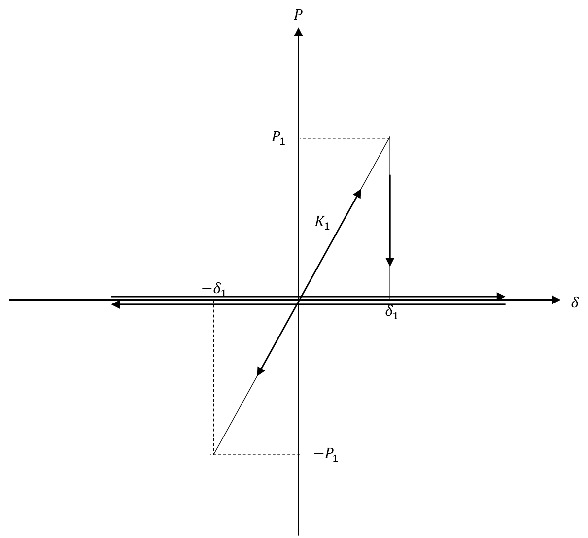

---

## 7.19. スリップばね

骨格曲線はバイリニアです。

**履歴ルール：**

1. $\delta$ が一度も $\pm\delta_1$ を超えない場合は原点を通る勾配 $K_1$ の直線上を動きます。

2. $\delta$ が初めて $\pm\delta_1$ を超えた場合、勾配 $K_2$ の直線上を進みます。

3. 勾配 $K_2$ の直線上から戻るときはその反転位置から勾配 $K_1$ で $F = 0$ まで戻り、さらに進むときは $\delta$ 軸上を原点まで進みます。反転位置は $\delta_{max}$ となります。

4. 以後、$\delta_{max}^- < \delta < \delta_{max}^+$ の範囲では、
   - $\delta_{max}^- \left( 1 + \frac{F_{max}^-}{K_1} \right) < \delta < \delta_{max}^+ \left( 1 - \frac{F_{max}^+}{K_1} \right)$ の場合、$\delta$ 軸上を移動します。
   - $\delta_{max}^- < \delta < \delta_{max}^- \left( 1 + \frac{F_{max}^-}{K_1} \right)$ または $\delta_{max}^+ \left( 1 - \frac{F_{max}^+}{K_1} \right) < \delta < \delta_{max}^+$ の場合、勾配 $K_1$ の直線上を移動します。

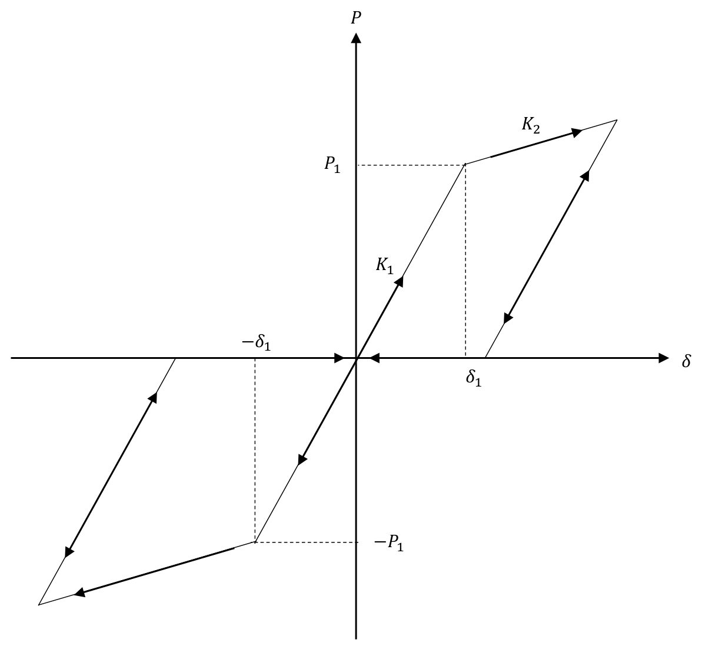

---

## 7.20. 軸力変動（共通）

軸力変動の履歴則は基本的に各履歴モデルに準拠します。軸力変動に伴う骨格曲線の更新やそれによる履歴ルールの追加規則は以下の通りとなります。なお、以下の説明は負側についても同様となります。

**記号の定義：**
- $M_y(i)$：ステップ $i$ での降伏モーメント
- $M_y(i+1)$：ステップ $i+1$ での降伏モーメント
- $\phi(i)$：ステップ $i+1$ での曲率
- $\phi(i+1)$：ステップ $i+1$ での曲率

### (1) 骨格曲線の移動

ステップ $i$ で骨格曲線上にあり、ステップ $i+1$ で曲率が増大する場合、もしくはステップ $i$ で初期剛性上にいる場合はステップ $i+1$ で新たな骨格曲線上にのせます。

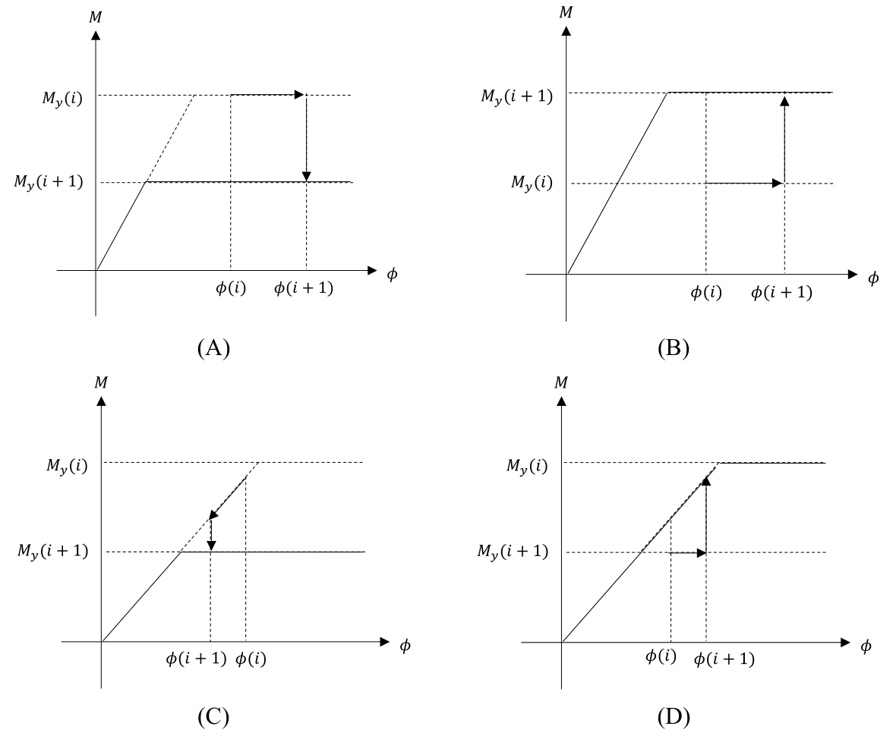

### (2) 除荷の開始

ステップ $i$ で第2勾配以降の骨格曲線上にあり、そこから除荷を受けた場合は、各履歴モデルのルールに準じた戻り勾配 $K_d$ の直線で戻ります。$K_d$ は次に再除荷を受けるまでは軸力が変動しても更新しないものとします。

$$K_d = K_1 \cdot \left| \frac{\phi_{max}}{\phi_1(N)} \right|^\alpha$$

(7.20.1)

ただし、$\phi_{max}$ は最大経験ひずみで $\phi_{max} < \phi_1$ の場合は $\phi_{max} = \phi_1$ とします。

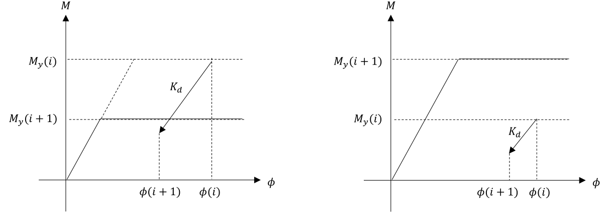

### (3) 最大点指向

JR総研剛性低減RC型等の履歴モデルでは、除荷曲線が $M = 0$ を超えると反対側の最大曲率点 $\phi_{min}$ を目指します。この時、骨格曲線が軸力の変動に応じて変化するため、目標とする最大点（$\phi_{min}$ と骨格の交点）も変化します。最大点を指向している最中はこの変化に応じて目標とする最大点を毎回更新するものとします。

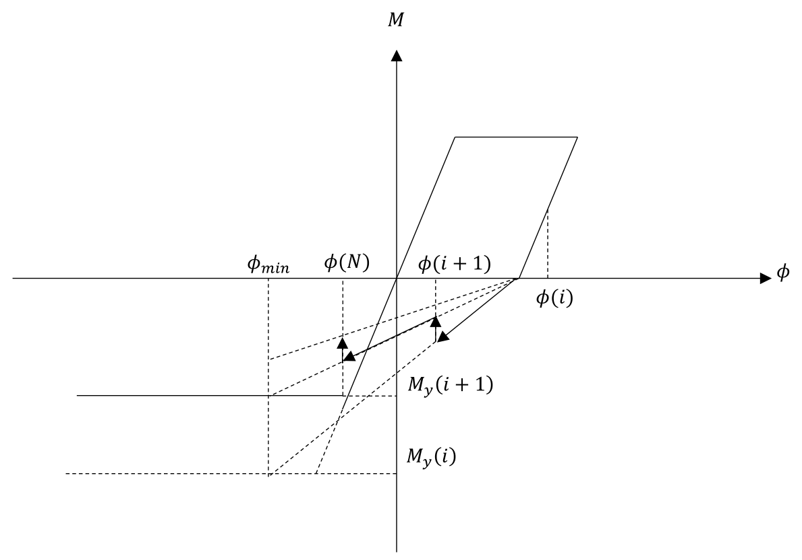

### (4) 内部ループ

内部ループがある履歴モデルの場合、以下の規則に従います。

1. 再載荷または再除荷時の戻り剛性 $K_d$ は、再載荷または再除荷時点の第1折れ点曲率 $\phi_1(N)$ を用いて計算し、$M = 0$ を超えるまで一定剛性で戻ります。

2. 最大点を指向している最中は軸力変動に応じて目標とする最大点を毎回更新するものとします。

### (5) 特殊な場合

除荷中にもかかわらず骨格曲線の外に出てしまった場合は、再度骨格曲線上に載せ、そこから除荷曲線を引き直します。JR剛性低減RC型などの履歴モデルでは、新たな除荷曲線の勾配 $K_d$ はステップ $i+1$ での第1折れ点曲率 $\phi_1(N)$ を使用して更新します。

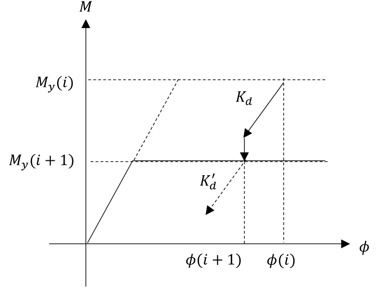

---

## 7.21. 履歴曲線の追跡

梁要素は要素の中央で曲げを評価して梁全体の剛性を変化させます。

> FrameWeb3の実装範囲（2026-09-08、第2段階）: 本節末尾の「実装の定式化」を参照。
> 中央断面のモーメント―曲率則と弾性せん断成分を組み合わせる。
> 以下の説明にある履歴接線による断面二次モーメントの逐次更新は実装していない。

梁要素のXY平面における曲げとせん断の要素剛性行列を抜き出すと以下の通りになります。

$$K = \begin{bmatrix}
\frac{12EI_z}{L^3(1+\phi_y)} & Sym \\
\frac{6EI_z}{L^2(1+\phi_y)} & \frac{(4+\phi_y)EI_z}{L(1+\phi_y)} \\
\frac{-12EI_z}{L^3(1+\phi_y)} & \frac{-6EI_z}{L^2(1+\phi_y)} & \frac{12EI_z}{L^3(1+\phi_y)} \\
\frac{6EI_z}{L^2(1+\phi_y)} & \frac{(2-\phi_y)EI_z}{L(1+\phi_y)} & \frac{-6EI_z}{L^2(1+\phi_y)} & \frac{(4+\phi_y)EI_z}{L(1+\phi_y)}
\end{bmatrix}$$

ただし、$\phi_y = \frac{12EI_z}{GA_yL^2}$

これをせん断と曲げに分離して書き直すと、

$$K = GA_y \frac{\phi_y}{1+\phi_y} \begin{bmatrix}
\frac{1}{L} & & & \\
\frac{1}{2} & \frac{L}{4} & & \\
\frac{-1}{L} & \frac{-1}{2} & \frac{1}{L} & \\
\frac{1}{2} & \frac{L}{4} & \frac{-1}{2} & \frac{L}{4}
\end{bmatrix} + EI_z \begin{bmatrix}
0 & & & \\
0 & \frac{1}{L} & & \\
0 & 0 & 0 & \\
0 & \frac{-1}{L} & 0 & \frac{1}{L}
\end{bmatrix}$$

同様にXZ平面における曲げとせん断の要素剛性行列をせん断と曲げに分離して書き直すと、

$$K = GA_z \frac{\phi_z}{1+\phi_z} \begin{bmatrix}
\frac{1}{L} & & & \\
\frac{-1}{2} & \frac{L}{4} & & \\
\frac{-1}{L} & \frac{1}{2} & \frac{1}{L} & \\
\frac{-1}{2} & \frac{L}{4} & \frac{1}{2} & \frac{L}{4}
\end{bmatrix} + EI_y \begin{bmatrix}
0 & & & \\
0 & \frac{1}{L} & & \\
0 & 0 & 0 & \\
0 & \frac{-1}{L} & 0 & \frac{1}{L}
\end{bmatrix}$$

梁の各変形量の増分は要素座標系を用いて次のように表すことができます。

**軸ひずみ**
$$\varepsilon = \frac{u_x^j - u_x^i}{L}$$

**せん断角**
$$\Delta\gamma_y = \frac{\phi_y}{1+\phi_y} \left( \frac{\Delta u_y^j - \Delta u_y^i}{L} - \frac{\Delta\theta_z^j + \Delta\theta_z^i}{2} \right)$$

$$\Delta\gamma_z = \frac{\phi_z}{1+\phi_z} \left( \frac{\Delta u_z^j - \Delta u_z^i}{L} + \frac{\Delta\theta_y^j + \Delta\theta_y^i}{2} \right)$$

**曲率（中央）**
$$\rho_z = \frac{\Delta\theta_z^j - \Delta\theta_z^i}{L}$$

$$\rho_y = \frac{\Delta\theta_y^j - \Delta\theta_y^i}{L}$$

ここに、
- $u_x^i$, $u_x^j$：$i$ 端、$j$ 端の $X_l$ 方向の変位
- $\Delta u_y^i$, $\Delta u_y^j$：$i$ 端、$j$ 端の $Y_l$ 方向の増分変位
- $\Delta u_z^i$, $\Delta u_z^j$：$i$ 端、$j$ 端の $Z_l$ 方向の増分変位
- $\Delta\theta_y^i$, $\Delta\theta_y^j$：$i$ 端、$j$ 端の $Y_l$ 軸回りの増分回転角
- $\Delta\theta_z^i$, $\Delta\theta_z^j$：$i$ 端、$j$ 端の $Z_l$ 軸回りの増分回転角

梁のせん断力増分 $\Delta F_y$ は以下の式で求めます。

$$\Delta F_y^i = -GA_y \Delta\gamma_y$$

(7.21.1)

$$\Delta F_y^j = GA_y \Delta\gamma_y$$

(7.21.2)

履歴曲線から曲率増分に対する真の曲げモーメント増分 $\Delta M_z$ と新たな断面2次モーメント $I_z$ を求めます。

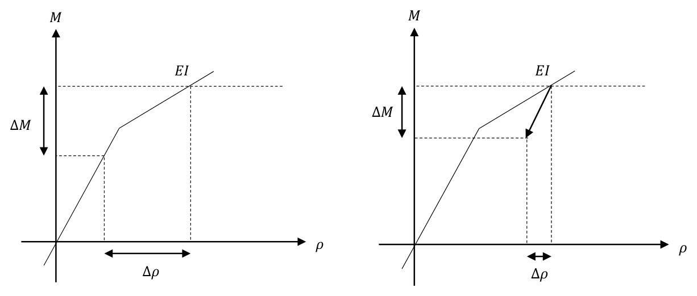

梁両端での真の増分曲げモーメントは以下の式で求めます。

$$\Delta M_z^i = -\frac{L\Delta F_y^j}{2} - \Delta M_z$$

(7.21.3)

$$\Delta M_z^j = -\frac{L\Delta F_y^j}{2} + \Delta M_z$$

(7.21.4)

さらに、幾何学的非線形性を考慮する場合は上記の $\Delta F_y^i$, $\Delta F_y^j$, $\Delta M_z^i$, $\Delta M_z^j$ に幾何剛性分の部材力が付加されます。ただし、履歴曲線から得られた曲げモーメントには幾何剛性分は含まれません。

また、XZ平面では同様に、

$$\Delta M_y^i = \frac{L\Delta F_z^j}{2} - \Delta M_y$$

(7.21.5)

$$\Delta M_y^j = \frac{L\Delta F_z^j}{2} + \Delta M_y$$

(7.21.6)

となります。

### 実装の定式化（材料非線形TDD・第2段階）

`NonlinearBarElement` は小変位・小回転の中央断面モデルである。
幾何学的非線形・有限剛体回転には対応しない。座標系と節点回転は右手系とし、
節点変位の順序を `[ux,uy,uz,rx,ry,rz]_i,j` とする。
`moment_y` はry（添字4,10）、`moment_z` はrz（添字5,11）へ作用する。

一般化ひずみを次のように定義する（増分ではなく、試行変位からの全ひずみ）。

$$e=Bq=\begin{bmatrix}
(u_x^j-u_x^i)/L\\
(\theta_x^j-\theta_x^i)/L\\
(\theta_y^j-\theta_y^i)/L\\
(\theta_z^j-\theta_z^i)/L\\
(u_y^j-u_y^i)/L-(\theta_z^i+\theta_z^j)/2\\
(u_z^j-u_z^i)/L+(\theta_y^i+\theta_y^j)/2
\end{bmatrix}
=\begin{bmatrix}\varepsilon&\tau&\rho_y&\rho_z&s_y&s_z\end{bmatrix}^T$$

ここで$s_y,s_z$はせん断角そのものではなく、弾性の曲げ・せん断柔性を縮約した変形量。
せん断補正係数を$k_y,k_z$と書くと、基準断面の固定係数は

$$C_y=\frac{12EI_zGk_yA}{12EI_z+Gk_yAL^2},\qquad
C_z=\frac{12EI_yGk_zA}{12EI_y+Gk_zAL^2}$$

となる。せん断変形を無視する場合は$C_y=12EI_z/L^2$, $C_z=12EI_y/L^2$。
せん断力は$V_y=C_y s_y$, $V_z=C_z s_z$とし、Cは反復中も更新しない。
履歴剛性からCを更新すると、内力の微分にCの変形依存項も必要になるため、
今回の実装では中央曲率モードだけを非線形化する。

確定履歴を$h_c$として、指定成分に$N(\varepsilon;h_c)$、$T_x(\tau;h_c)$、
$M_y(\rho_y;h_c)$、$M_z(\rho_z;h_c)$を使用する。
未指定成分はそれぞれ$EA\varepsilon,GJ\tau,EI_y\rho_y,EI_z\rho_z$。
一般化断面力$p=[N,T_x,M_y,M_z,V_y,V_z]^T$から仮想仕事により

$$\delta W=L\,\delta e^T p=\delta q^T f_l,\qquad
f_l=L B^T p,\qquad K_l=L B^T D B,\qquad
D=\operatorname{diag}\left(\frac{\partial p_a}{\partial e_a}\right)$$

を得る。内力と接線は同じ評価関数で計算する。折れ点・履歴分岐切替点では微分が一意とは限らない。
全体座標系では$q=T u$、$f_g=T^T f_l$、$K_g=T^T K_l T$とする。
これは対角剛性や端部力の個別置換ではない。

局所節点内力は両端とも同じ軸・右手系の符号で出力する。
軸力は$(-N,+N)$、ねじりは$(-T_x,+T_x)$、せん断は$(-V,+V)$。
曲げは$M_{yi}=LV_z/2-M_y$, $M_{yj}=LV_z/2+M_y$、
$M_{zi}=-LV_y/2-M_z$, $M_{zj}=-LV_y/2+M_z$であり、7.21.3〜6と整合する。
断面の左右切断面を統一した応力符号への変換は行わない。

#### 材料入力と互換性

| hysteresis_dofs | δの意味・単位 | Pの意味・単位 | 初期勾配の弾性対応 |
|---|---|---|---|
| axial | 軸ひずみ・無次元 | 軸力・F | EA |
| moment_y / moment_z | 中央曲率・rad/ℓ | 曲げモーメント・Fℓ | EI_y / EI_z |
| torsion | ねじり率・rad/ℓ | ねじりモーメント・Fℓ | GJ |

Fとℓは使用する整合単位系の力と長さ。例えばN・m系では曲率はrad/m、曲げモーメントはN m。
正の軸ひずみは引張、正の曲率・ねじり率はj端回転の増加。
負側の折れ点δ,Pは既存入力どおり正の絶対値で指定し、履歴則が符号を付ける。
初期勾配を表のEA/EI/GJに一致させた場合、弾性極限は線形Timoshenko梁
（せん断変形なしならBernoulli–Euler梁）と一致する。
一致させない場合、中央モードは入力骨格の初期剛性、Cは基準E,Iの剛性となる。

JSONとPython APIのδ,Pキーは変更しないが、従来の絶対端部変位を用いた数値結果は引き継がない。
`beam001.json` 等の既存入力には単位やヒンジ長の情報がなく、意図した物理量の再確認が必要である。
複数適用先へ同じ骨格を渡す現行APIでは数値をそのまま各物理量として使い、単位換算はしない。
曲げのM―相対回転θとM―曲率ρは別の特性である。明示的なヒンジ長があればρ=θ/ℓpという
換算はできるが、本要素は集中ヒンジモデルを実装せず、ヒンジ長の推定や自動換算はしない。

#### 試行状態と検証の限界

各適用先に中央一点の確定状態と試行候補を置く。各内力評価は確定状態のコピーから始め、
収束時のみcommitする。接線・出力評価では候補も更新しない。rollbackは最後の確定状態へ戻す。
出力は収束時に保存した局所節点内力を使い、JR履歴則を再評価して履歴を進めない。
状態取得APIの位置キーは旧`i_end/j_end`から`center`へ変更した。

確認したのは剛体並進と微小剛体回転、端部力の釣合い、滑らかな区間の整合接線、
両曲げ方向、任意方向の座標変換、弾性片持ち梁、非線形純曲げ、1/4要素分割、試行順序、収束断面力。
中央一点の曲げモデルなので、非一様な塑性進展や一般の非線形分割収束を保証しない。
JR則の反転判定・力ゼロ通過・内部ループ・K_min・第4勾配は第3段階で修正・検証した。
7.11節の注記と修正プランに記載した補完仕様に基づくもので、外部実装との一致は未検証。
この実装変更は材料非線形解析全体の妥当性確認完了を意味しない。
